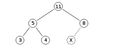
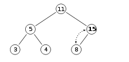
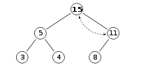
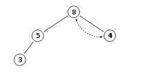

# 优先队列及堆排序

堆排序( `Heap Sort` )由威尔士-加拿大计算机科学家 `J. W. J. Williams` 在 `1964` 年发明，它利用了二叉堆 `(A binary heap)` 的性质实现了排序，并证明了二叉堆数据结构的可用性。同年，美国籍计算机科学家 `R. W. Floyd` 在其树排序研究的基础上，发布了一个改进的更好的原地排序的堆排序版本。

堆排序属于选择类排序算法。

## 一、优先队列

优先队列是一种能完成以下任务的队列：插入一个数值，取出最小或最大的数值（获取数值，并且删除）。

优先队列可以用二叉树来实现，我们称这种结构为二叉堆。

最小堆和最大堆是二叉堆的一种，是一棵完全二叉树（一种平衡树）。

最小堆的性质：

1. 父节点的值都小于左右儿子节点。
2. 这是一个递归的性质。

最大堆的性质：

1. 父节点的值都大于左右儿子节点。
2. 这是一个递归的性质。

最大堆和最小堆实现方式一样，只不过根节点一个是最大的，一个是最小的。

## 1.1. 最大堆特征

最大堆实现细节(两个操作)：

1. push：向堆中插入数据时，首先在堆的末尾插入数据，如果该数据比父亲节点还大，那么交换，然后不断向上提升，直到没有大小颠倒为止。
2. pop：从堆中删除最大值时，首先把最后一个值复制到根节点上，并且删除最后一个数值，然后和儿子节点比较，如果值小于儿子，与儿子节点交换，然后不断向下交换， 直到没有大小颠倒为止。在向下交换过程中，如果有两个子儿子都大于自己，就选择较大的。

最大堆有两个核心操作，一个是上浮，一个是下沉，分别对应 `push` 和 `pop`。

这是一个最大堆：



用数组表示为：`[11 5 8 3 4]`

## 1.2. 上浮操作

我们要往堆里 `push` 一个元素 `15`，我们先把 `X = 15` 放到树最尾部，然后进行上浮操作。

因为 `15` 大于其父亲节点 `8`，所以与父亲替换：



这时 `15` 还是大于其父亲节点 `11`，继续替换：




操作一次 `push` 的最好时间复杂度为：`O(1)`，因为第一次上浮时如果不大于父亲，那么就结束了。最坏的时间复杂度为： `O(logn)`，相当于每次都大于父亲，会一直往上浮到根节点，翻转次数等于树的高度，而树的高度等于元素个数的对数：`log(n)`。

## 1.3. 下沉操作

我们现在要将堆顶的元素 `pop` 出。如图我们要移除最大的元素 `11`：


我们先将根节点移除，然后将最尾部的节点 `4` 放在根节点上：


接着对根节点 `4` 进行下沉操作，与其两个儿子节点比较，发现较大的儿子节点 `8` 比 `4` 大，那么根节点 `4` 与其儿子节点 `8` 交换位置，向下翻转：



这样一直向下翻转就维持了最大堆的特征。

操作一次 `pop` 最好的时间复杂度也是：`O(1)`，因为第一次比较时根节点就是最大的。最坏时间复杂度仍然是树的高度：`O(logn)`。

## 1.4. 时间复杂度分析

构建一个最大堆，从空堆开始，每次添加元素到尾部后，需要向上翻转，最坏翻转次数是：

```
第一次添加元素翻转次数：log1
第二次添加元素翻转次数：log2
第三次添加元素翻转次数：不大于log3的最大整数
第四次添加元素翻转次数：log4
第五次添加元素翻转次数：不大于log5的最大整数
...
第N次添加元素翻转次数：不大于logn的最大整数

近似 = log(1)+log(2)+log(3)+...+log(n) = log(n!)
```

从一个最大堆，逐一移除堆顶元素，然后将堆尾元素置于堆顶后，向下翻转恢复堆特征，最坏翻转次数是:

```
第一次移除元素恢复堆时间复杂度：logn
第二次移除元素恢复堆时间复杂度：不大于log(n-1)的最大整数
第三次移除元素恢复堆时间复杂度：不大于log(n-2)的最大整数
...
第N次移除元素恢复堆时间复杂度：log1

近似 = log(1)+log(2)+log(3)+...+log(n) = log(n!)
```

根据斯特林公式：


可以进行证明 `log(n!)` 和 `nlog(n)` 是同阶的：


所以构建一个最大堆的最坏时间复杂度是：`O(nlogn)`。

从堆顶一个个移除元素，直到移完，整个过程最坏时间复杂度也是：`O(nlogn)`。

从构建堆到移除堆，总的最坏复杂度是：`O(nlogn)+O(nlogn)`，我们可以认为是：`O(nlogn)`。

如果所有的元素都一样的情况下，建堆和移除堆的每一步都不需要翻转，最好时间复杂度为：`O(n)`，复杂度主要在于遍历元素。

如果元素不全一样，即使在建堆的时候不需要翻转，但在移除堆的过程中一定会破坏堆的特征，导致恢复堆时需要翻转。比如一个 `n` 个元素的已排好的序的数列，建堆时每次都满足堆的特征，不需要上浮翻转，但在移除堆的过程中最尾部元素需要放在根节点，这个时候导致不满足堆的特征，需要下沉翻转。因此，在最好情况下，时间复杂度仍然是：`O(nlog)`。

因此，最大堆从构建到移除，总的平均时间复杂度是：`O(nlogn)`。

## 1.5. 最大堆实现

```go
// 一个最大堆，一棵完全二叉树
// 最大堆要求节点元素都不小于其左右孩子
type Heap struct {
	// 堆的大小
	Size int
	// 使用内部的数组来模拟树
	// 一个节点下标为 i，那么父亲节点的下标为 (i-1)/2
	// 一个节点下标为 i，那么左儿子的下标为 2i+1，右儿子下标为 2i+2
	Array []int
}

// 初始化一个堆
func NewHeap(array []int) *Heap {
	h := new(Heap)
	h.Array = array
	return h
}

// 最大堆插入元素
func (h *Heap) Push(x int) {
	// 堆没有元素时，使元素成为顶点后退出
	if h.Size == 0 {
		h.Array[0] = x
		h.Size++
		return
	}

	// i 是要插入节点的下标
	i := h.Size

	// 如果下标存在
	// 将小的值 x 一直上浮
	for i > 0 {
		// parent为该元素父亲节点的下标
		parent := (i - 1) / 2

		// 如果插入的值小于等于父亲节点，那么可以直接退出循环，因为父亲仍然是最大的
		if x <= h.Array[parent] {
			break
		}

		// 否则将父亲节点与该节点互换，然后向上翻转，将最大的元素一直往上推
		h.Array[i] = h.Array[parent]
		i = parent
	}

	// 将该值 x 放在不会再翻转的位置
	h.Array[i] = x

	// 堆数量加一
	h.Size++
}

// 最大堆移除根节点元素，也就是最大的元素
func (h *Heap) Pop() int {
	// 没有元素，返回-1
	if h.Size == 0 {
		return -1
	}

	// 取出根节点
	ret := h.Array[0]

	// 因为根节点要被删除了，将最后一个节点放到根节点的位置上
	h.Size--
	x := h.Array[h.Size]  // 将最后一个元素的值先拿出来
	h.Array[h.Size] = ret // 将移除的元素放在最后一个元素的位置上

	// 对根节点进行向下翻转，小的值 x 一直下沉，维持最大堆的特征
	i := 0
	for {
		// a，b为下标 i 左右两个子节点的下标
		a := 2*i + 1
		b := 2*i + 2

		// 左儿子下标超出了，表示没有左子树，那么右子树也没有，直接返回
		if a >= h.Size {
			break
		}

		// 有右子树，拿到两个子节点中较大节点的下标
		if b < h.Size && h.Array[b] > h.Array[a] {
			a = b
		}

		// 父亲节点的值都大于或等于两个儿子较大的那个，不需要向下继续翻转了，返回
		if x >= h.Array[a] {
			break
		}

		// 将较大的儿子与父亲交换，维持这个最大堆的特征
		h.Array[i] = h.Array[a]

		// 继续往下操作
		i = a
	}

	// 将最后一个元素的值 x 放在不会再翻转的位置
	h.Array[i] = x
	return ret
}
```

以上为最大堆的实现。

## 三、普通堆排序

根据最大堆，堆顶元素一直是最大的元素特征，可以实现堆排序。

先构建一个最小堆，然后依次把根节点元素 `pop` 出即可：

```go
func main() {
	list := []int{5, 9, 1, 6, 8, 14, 6, 49, 25, 4, 6, 3}

	// 构建最大堆
	h := NewHeap(list)
	for _, v := range list {
		h.Push(v)
	}

	// 将堆元素移除
	for range list {
		h.Pop()
	}

	// 打印排序后的值
	fmt.Println(list)
}
```

输出：

```
1 3 4 5 6 6 6 8 9 14 25 49 
```

根据以上最大堆的时间复杂度分析，从堆构建到移除最坏和最好的时间复杂度：`O(nlogn)`，这也是堆排序的最好和最坏的时间复杂度。

这样实现的堆排序是普通的堆排序，性能不是最优的。

因为一开始会认为堆是空的，每次添加元素都需要添加到尾部，然后向上翻转，需要用 `Heap.Size` 来记录堆的大小增长，这种堆构建，可以认为是非原地的构建，影响了效率。

美国籍计算机科学家 `R. W. Floyd` 改进的原地自底向上的堆排序，不会从空堆开始，而是把待排序的数列当成一个混乱的最大堆，从底层逐层开始，对元素进行下沉操作，一直恢复最大堆的特征，直到根节点。

将构建堆的时间复杂度从 `O(nlogn)` 降为 `O(n)`，总的堆排序时间复杂度从 `O(2nlogn)` 改进到 `O(n+nlogn)`。

## 三、自底向上堆排序

自底向上堆排序，仅仅将构建堆的时间复杂度从 `O(nlogn)` 改进到 `O(n)`，其他保持不变。

这种堆排序，不再每次都将元素添加到尾部，然后上浮翻转，而是在混乱堆的基础上，从底部向上逐层进行下沉操作，下沉操作比较的次数会减少。步骤如下：

1. 先对最底部的所有非叶子节点进行下沉，即这些非叶子节点与它们的儿子节点比较，较大的儿子和父亲交换位置。
2. 接着从次二层开始的非叶子节点重复这个操作，直到到达根节点最大堆就构建好了。

从底部开始，向上推进，所以这种堆排序又叫自底向上的堆排序。

为什么自底向上构建堆的时间复杂度是：`O(n)`。证明如下：

第 `k` 层的非叶子节点的数量为 `n/2^k`，每一个非叶子节点下沉的最大次数为其子孙的层数：`k`，而树的层数为 `logn` 层，那么总的翻转次数计算如下：


因为如下的公式是成立的：


所以翻转的次数计算结果为：`2n` 次。也就是构建堆的时间复杂度为：`O(n)`。

我们用非递归的形式来实现，非递归相对容易理解：

```go
package main

import "fmt"

// 先自底向上构建最大堆，再移除堆元素实现堆排序
func HeapSort(array []int) {
	// 堆的元素数量
	count := len(array)

	// 最底层的叶子节点下标，该节点位置不定，但是该叶子节点右边的节点都是叶子节点
	start := count/2 + 1

	// 最后的元素下标
	end := count - 1

	// 从最底层开始，逐一对节点进行下沉
	for start >= 0 {
		sift(array, start, count)
		start-- // 表示左偏移一个节点，如果该层没有节点了，那么表示到了上一层的最右边
	}

	// 下沉结束了，现在要来排序了
	// 元素大于2个的最大堆才可以移除
	for end > 0 {
		// 将堆顶元素与堆尾元素互换，表示移除最大堆元素
		array[end], array[0] = array[0], array[end]
		// 对堆顶进行下沉操作
		sift(array, 0, end)
		// 一直移除堆顶元素
		end--
	}
}

// 下沉操作，需要下沉的元素时 array[start]，参数 count 只要用来判断是否到底堆底，使得下沉结束
func sift(array []int, start, count int) {
	// 父亲节点
	root := start

	// 左儿子
	child := root*2 + 1

	// 如果有下一代
	for child < count {
		// 右儿子比左儿子大，那么要翻转的儿子改为右儿子
		if count-child > 1 && array[child] < array[child+1] {
			child++
		}

		// 父亲节点比儿子小，那么将父亲和儿子位置交换
		if array[root] < array[child] {
			array[root], array[child] = array[child], array[root]
			// 继续往下沉
			root = child
			child = root*2 + 1
		} else {
			return
		}
	}
}

func main() {
	list := []int{5, 9, 1, 6, 8, 14, 6, 49, 25, 4, 6, 3}

	HeapSort(list)

	// 打印排序后的值
	fmt.Println(list)
}
```

输出：

```go
[1 3 4 5 6 6 6 8 9 14 25 49]
```


