# 2-3树和左倾红黑树

某些教程不区分普通红黑树和左倾红黑树的区别，直接将左倾红黑树拿来教学，并且称其为红黑树，因为左倾红黑树与普通的红黑树相比，实现起来较为简单，容易教学。在这里，我们区分开左倾红黑树和普通红黑树。

红黑树是一种近似平衡的二叉查找树，从 `2-3` 树或 `2-3-4` 树衍生而来。通过对二叉树节点进行染色，染色为红或黑节点，来模仿 `2-3` 树或 `2-3-4` 树的3节点和4节点，从而让树的高度减小。

`2-3-4` 树对照实现的红黑树是普通的红黑树，而 `2-3` 树对照实现的红黑树是一种变种，称为左倾红黑树，其更容易实现。

我们在本章介绍 `2-3` 树，再用二叉树形式来实现 `2-3` 树，也就是左倾红黑树。

## 一、`2-3` 树

### 1.1. `2-3` 树介绍

`2-3` 树是一棵严格自平衡的多路查找树，由1986年图灵奖得主，美国理论计算机科学家 `John Edward Hopcroft` 在1970年发明，又称 `3阶的B树` (注：`B` 为 `Balance` 平衡的意思) 

它不是一棵二叉树，是一颗三叉树。具有以下特征：

1. 内部节点要么有1个数据元素和2个孩子，要么有2个数据元素和3个孩子，叶子节点没有孩子，但有1或2个数据元素。
2. 所有叶子节点到根节点的长度一致。这个特征保证了完全平衡，非常完美的平衡。
3. 每个节点的数据元素保持从小到大排序，两个数据元素之间的子树的所有值大小介于两个数据元素之间。

因为 `2-3` 树的第二个特征，它是一颗完美平衡的树，非常完美，除了叶子节点，其他的节点都没有空儿子，所以树的高度非常的小。

如图：


如果一个内部节点拥有一个数据元素、两个子节点，则此节点为2节点。如果一个内部节点拥有两个数据元素、三个子节点，则此节点为3节点。

可以说，所有平衡树的核心都在于插入和删除逻辑，我们主要分析这两个操作。

### 1.2. `2-3` 树插入元素

在插入元素时，需要先找到插入的位置，使用二分查找从上自下查找树节点。

找到插入位置时，将元素插入该位置，然后进行调整，使得满足 `2-3` 树的特征。主要有三种情况：

1. 插入元素到一个2节点，直接插入即可，这样节点变成3节点。
2. 插入元素到一个3节点，该3节点的父亲是一个2节点，先将节点变成临时的4节点，然后向上分裂调整一次。
2. 插入元素到一个3节点，该3节点的父亲是一个3节点，先将节点变成临时的4节点，然后向上分裂调整，此时父亲节点变为临时4节点，继续向上分裂调整。

如图（来自维基百科）：


核心在于插入3节点后，该节点变为临时4节点，然后进行分裂恢复树的特征。最坏情况为插入节点后，每一次分裂后都导致上一层变为临时4节点，直到树根节点，这样需要不断向上分裂。

临时4节点的分裂，细分有六种情况，如图：

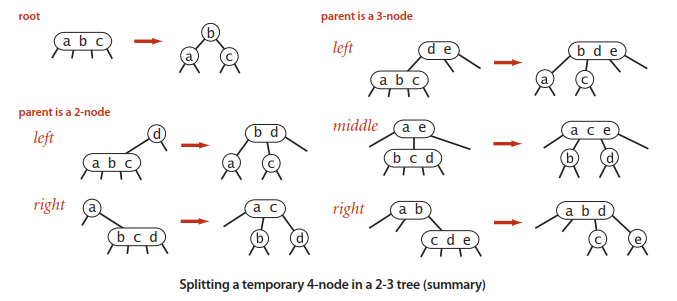

与其他二叉查找树由上而下生长不同，`2-3` 树是从下至上的生长。

`2-3` 树的实现将会放在 `B树` 章节，我们将会在此章节实现其二叉树形式的左倾红黑树结构。

### 1.3. `2-3` 树删除元素

删除操作就复杂得多了，请耐心阅读理解。

`2-3` 树的特征注定它是一颗非常完美平衡的三叉树，其所有子树也都是完美平衡，所以 `2-3` 树的某节点的儿子，要么都是空儿子，要么都不是空儿子。比如 `2-3` 树的某个节点 `A` 有两个儿子 `B` 和 `C`，儿子 `B` 和 `C` 要么都没有孩子，要么孩子都是满的，不然 `2-3` 树所有叶子节点到根节点的长度一致这个特征就被破坏了。

基于上面的现实，我们来分析删除的不同情况，删除中间节点和叶子节点。

情况1：删除中间节点

删除的是非叶子节点，该节点一定是有两颗或者三颗子树的，那么从子树中找到其最小后继节点，该节点是叶子节点，用该节点替换被删除的非叶子节点，然后再删除这个叶子节点，进入情况2。

如何找到最小后继节点，当有两颗子树时，那么从右子树一直往左下方找，如果有三颗子树，被删除节点在左边，那么从中子树一直往左下方找，否则从右子树一直往左下方找。

情况2：删除叶子节点

删除的是叶子节点，这时如果叶子节点是3节点，那么直接变为2节点即可，不影响平衡。但是，如果叶子节点是2节点，那么删除后，其父节点将会缺失一个儿子，破坏了满孩子的 `2-3` 树特征，需要进行调整后才能删除。

针对情况2，删除一个2节点的叶子节点，会导致父节点缺失一个儿子，我们可以进行调整变换后，主要有两种调整：

1. 重新分布：尝试从兄弟节点那里借值，然后重新调整节点。
2. 合并：如果兄弟借不到值，合并节点再向上递归处理。

看图说话：

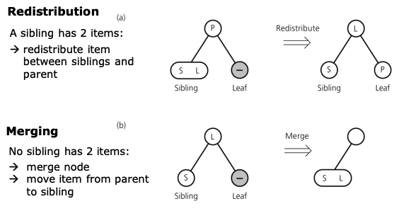

如果被删除的叶子节点有兄弟是3节点，那么从兄弟那里借一个值填补被删除的叶子节点，然后兄弟和父亲重新分布调整位置。下面是重新分布的具体例子：

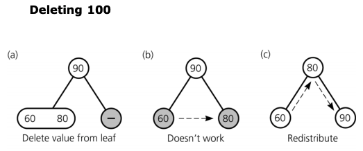

可以看到，删除 `100`，从兄弟那里借来一个值 `80`，然后重新调整父亲，兄弟们的位置。

如果兄弟们都是2节点呢，那么就合并节点：将父亲和兄弟节点合并，如果父亲是2节点，那么父亲就留空了，否则父亲就从3节点变成2节点，下面是合并的两个具体例子：

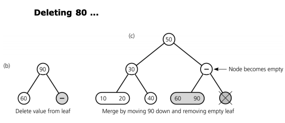

可以看到，删除 `80`，而兄弟节点 `60` 和父亲节点 `90` 都是个2节点，所以父亲下来和兄弟合并，然后父亲变为空节点。

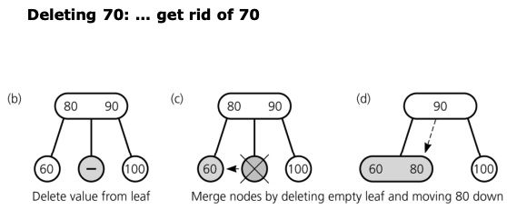

可以看到，删除 `70`，而兄弟节点都为2节点，父亲节点为3节点，那么父亲下来和其中一个兄弟合并，然后父亲从3节点变为2节点。

但是，如果合并后，父亲节点变空了，也就是说有中间节点留空要怎么办，那么可以继续递归处理，如图：


中间节点是空的，那么可以继续从兄弟那里借节点或者和父亲合并，直到根节点，如果到达了根节点呢，如图：

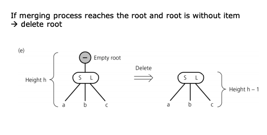

递归到了根节点后，如果存在空的根节点，我们可以直接把该空节点删除即可，这时树的高度减少一层。

`2-3` 树的实现将会放在 `B树` 章节，我们将会实现其二叉树形式的左倾红黑树结构。

## 二、 左倾红黑树

### 2.1. 左倾红黑树介绍

左倾红黑树可以由 `2-3` 树的二叉树形式来实现。

其定义为：

1. 根节点的链接是黑色的。
2. 红链接均为左链接。
3. 没有任何一个结点同时和两条红链接相连
4. 该树是完美黑色平衡的，即任意空链接到根节点的路径上的黑链接数量相同。

由于红链接都在左边，所以这种红黑树又称左倾红黑树。左倾红黑树与 `2-3` 树一一对应，只要将左链接画平，如图：


### 2.2. 节点旋转和颜色转换

首先，我们要定义树的结构 `LLRBTree` ，以及表示左倾红黑树的节点 `LLRBTNode`：

```go
// 定义颜色
const (
	RED   = true
	BLACK = false
)

// 左倾红黑树
type LLRBTree struct {
	Root *LLRBTNode // 树根节点
}


// 左倾红黑树节点
type LLRBTNode struct {
	Value       int64     // 值
	Times       int64      // 值出现的次数
	Left        *LLRBTNode // 左子树
	Right       *LLRBTNode // 右子树
	Color       bool       // 父亲指向该节点的链接颜色
}

// 新建一颗空树
func NewLLRBTree() *LLRBTree {
	return &LLRBTree{}
}

// 左链接的颜色
func IsRed(node *LLRBTNode) bool {
	if node == nil {
		return false
	}
	return node.Color == RED
}

```

在节点 `LLRBTNode` 中，我们存储的元素字段为 `Value`，由于可能有重复的元素插入，所以多了一个 `Times` 字段，表示该元素出现几次。

当然，红黑树中的红黑颜色使用 `Color` 定义，表示父亲指向该节点的链接颜色。为了方便，我们还构造了一个辅助函数 `IsRed()`。

在元素添加和实现的过程中，需要做调整操作，有两种旋转操作，对某节点的右链接进行左旋转，或者左链接进行右旋转。

如图是对节点 `h` 的右链接进行左旋转：

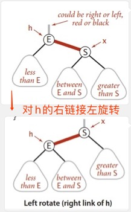

代码实现如下：

```go
// 左旋转
func RotateLeft(h *LLRBTNode) *LLRBTNode {
	if h == nil {
		return nil
	}

	// 看图理解
	x := h.Right
	h.Right = x.Left
	x.Left = h
	x.Color = h.Color
	h.Color = RED
	return x
}
```

如图是对节点 `h` 的左链接进行右旋转：


代码实现如下：

```go
// 右旋转
func RotateRight(h *LLRBTNode) *LLRBTNode {
	if h == nil {
		return nil
	}

	// 看图理解
	x := h.Left
	h.Left = x.Right
	x.Right = h
	x.Color = h.Color
	h.Color = RED
	return x
}
```

由于左倾红黑树不允许一个节点有两个红链接，所以需要做颜色转换，如图：


代码如下：

```go
// 颜色转换
func ColorChange(h *LLRBTNode) {
	if h == nil {
		return
	}
	h.Color = !h.Color
	h.Left.Color = !h.Left.Color
	h.Right.Color = !h.Right.Color
}
```

旋转和颜色转换作为局部调整，并不影响全局。

### 2.3. 添加元素实现

每次添加元素节点时，都将该节点 `Color` 字段，也就是父亲指向它的链接设置为 `RED` 红色。

接着判断其父亲是否有两个红链接（如连续的两个左红链接或者左右红色链接），或者有右红色链接，进行颜色变换或旋转操作。

主要有以下这几种情况。

插入元素到2节点，直接让节点变为3节点，不过当右插入时需要左旋使得红色链接在左边，如图：


插入元素到3节点，需要做旋转和颜色转换操作，如图：

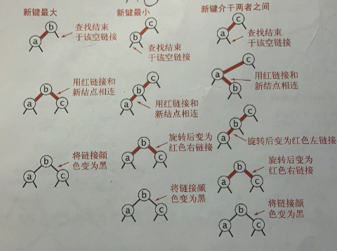

也就是说，在一个已经是红色左链接的节点，插入一个新节点的状态变化如下：

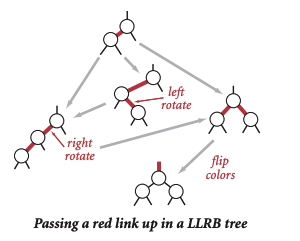

根据上述的演示图以及旋转，颜色转换等操作，添加元素的代码为：

```go
// 左倾红黑树添加元素
func (tree *LLRBTree) Add(value int64) {
	// 跟节点开始添加元素，因为可能调整，所以需要将返回的节点赋值回根节点
	tree.Root = tree.Root.Add(value)
	// 根节点的链接永远都是黑色的
	tree.Root.Color = BLACK
}

// 往节点添加元素
func (node *LLRBTNode) Add(value int64) *LLRBTNode {
	// 插入的节点为空，将其链接颜色设置为红色，并返回
	if node == nil {
		return &LLRBTNode{
			Value: value,
			Color: RED,
		}
	}

	// 插入的元素重复
	if value == node.Value {
		node.Times = node.Times + 1
	} else if value > node.Value {
		// 插入的元素比节点值大，往右子树插入
		node.Right = node.Right.Add(value)
	} else {
		// 插入的元素比节点值小，往左子树插入
		node.Left = node.Left.Add(value)
	}

	// 辅助变量
	nowNode := node

	// 右链接为红色，那么进行左旋，确保树是左倾的
	// 这里做完操作后就可以结束了，因为插入操作，新插入的右红链接左旋后，nowNode节点不会出现连续两个红左链接，因为它只有一个左红链接
	if IsRed(nowNode.Right) && !IsRed(nowNode.Left) {
		nowNode = RotateLeft(nowNode)
	} else {
		// 连续两个左链接为红色，那么进行右旋
		if IsRed(nowNode.Left) && IsRed(nowNode.Left.Left) {
			nowNode = RotateRight(nowNode)
		}

		// 旋转后，可能左右链接都为红色，需要变色
		if IsRed(nowNode.Left) && IsRed(nowNode.Right) {
			ColorChange(nowNode)
		}
	}

	return nowNode
}
```

### 2.4. 添加元素算法分析

可参考论文： [Left-leaning Red-Black Trees](https://www.cs.princeton.edu/~rs/talks/LLRB/LLRB.pdf)。

左倾红黑树的最坏树高度为 `2log(n)`，其中 `n` 为树的节点数量。为什么呢，我们先把左倾红黑树当作 `2-3` 树，也就是说最坏情况下沿着 `2-3` 树左边的节点都是3节点，其他节点都是2节点，这时树高近似 `log(n)`，再从 `2-3` 树转成左倾红黑树，当3节点不画平时，可以知道树高变成原来 `2-3` 树树高的两倍。虽然如此，构造一颗最坏的左倾红黑树很难。

`AVL` 树的最坏树高度为 `1.44log(n)`。由于左倾红黑树是近似平衡的二叉树，没有 `AVL` 树的严格平衡，树的高度会更高一点，因此查找操作效率比 `AVL` 树低，但时间复杂度只在于常数项的差别，去掉常数项，时间复杂度仍然是 `log(n)`。

我们的代码实现中，左倾红黑树的插入，需要逐层判断是否需要旋转和变色，复杂度为 `log(n)`，当旋转变色后导致上层存在连续的红左链接或者红色左右链接，那么需要继续旋转和变色，可能有多次这种调整操作，如图在箭头处添加新节点，出现了右红链接，然后要一直旋转变色到根节点（穿投到根节点的情况极少发生）：

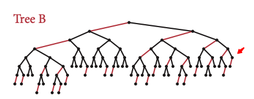

我们可以优化代码，使得在某一层旋转变色后，如果其父层没有连续的左红链接或者不需要变色，那么可以直接退出，不需要逐层判断是否需要旋转和变色。

对于 `AVL` 树来说，插入最多旋转两次，但其需要逐层更新树高度，复杂度也是为 `log(n)`。

按照插入效率来说，很多教程都说左倾红黑树会比 `AVL` 树好一点，因为其不要求严格的平衡，会插入得更快点，但根据我们实际上的递归代码，两者都需要逐层向上判断是否需要调整，只不过 `AVL` 树多了更新树高度的操作，此操作影响了一点点效率，但我觉得两种树的插入效率都差不多。

在此，我们不再纠结两种平衡树哪种更好，因为代码实现中，两种平衡树都需要自底向上的递归操作，效率差别不大。。

### 2.5. 删除元素实现

删除操作就复杂得多了。对照一下 `2-3` 树。

1. 情况1：如果删除的是非叶子节点，找到其最小后驱节点，也就是在其右子树中一直向左找，找到的该叶子节点替换被删除的节点，然后删除该叶子节点，变成情况2。
2. 情况2：如果删除的是叶子节点，如果它是红节点，也就是父亲指向它的链接为红色，那么直接删除即可。否则，我们需要进行调整，使它变为红节点，再删除。

在这里，为了使得删除叶子节点时可以直接删除，叶子节点必须变为红节点。（在 `2-3` 树中，也就是2节点要变成3节点，我们知道要不和父亲合并再递归向上，要不向兄弟借值然后重新分布）

我们创造两种操作，如果删除的节点在左子树中，可能需要进行红色左移，如果删除的节点在右子树中，可能需要进行红色右移。

我们介绍红色左移的步骤：

要在子树 `b` 的的左子树中删除元素，这时树 `b` 根节点是红节点，其儿子 `a，c` 节点都为黑色节点，且两个黑色节点都是2节点，都没有左红孩子，那么直接变色即可（相当于 `2-3` 树：把父亲的一个值拉下来合并），如图：

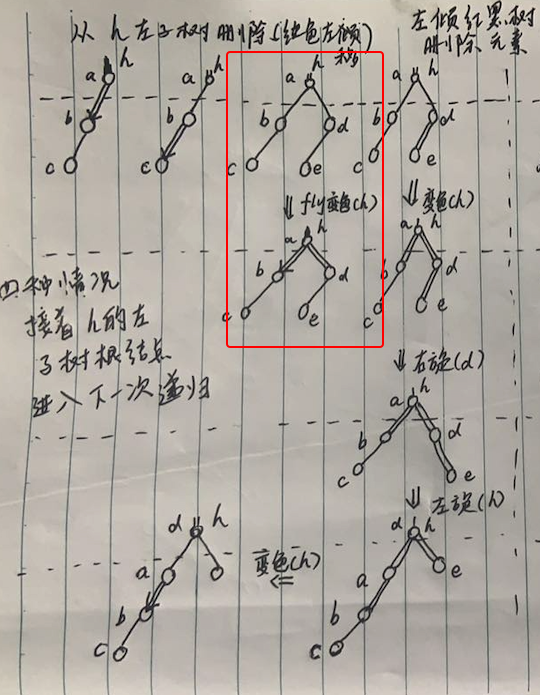

如果存在右儿子是3节点，有左红孩子，那么需要先变色后，对兄弟节点右旋，再对父亲节点左旋，最后变色（相当于 `2-3` 树：向3节点兄弟借值，然后重新分布），如图：


红色左移可以总结为下图（被删除的节点在左子树，且进入的树根一定为红节点）：

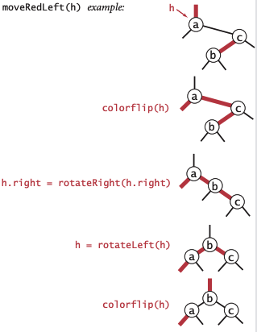

代码如下：

```go
// 红色左移
// 节点 h 是红节点，其左儿子和左儿子的左儿子都为黑节点，左移后使得其左儿子或左儿子的左儿子有一个是红色节点
func MoveRedLeft(h *LLRBTNode) *LLRBTNode {
	// 应该确保 isRed(h) && !isRed(h.left) && !isRed(h.left.left)
	ColorChange(h)

	// 右儿子有左红链接
	if IsRed(h.Right.Left) {
		// 对右儿子右旋
		h.Right = RotateRight(h.Right)
		// 再左旋
		h = RotateLeft(h)
		ColorChange(h)
	}

	return h
}
```

为什么要红色左移，是要保证调整后，子树根节点 `h` 的左儿子或左儿子的左儿子有一个是红色节点，这样从 `h` 的左子树删除元素，才可以继续递归下去，递归的结局就是被删除的叶子节点变成一个红色节点，然后就可以直接删除了。

红色右移的步骤类似，如图（被删除的节点在右子树，且进入的树根一定为红节点）：


代码如下：

```go
// 红色右移
// 节点 h 是红节点，其右儿子和右儿子的左儿子都为黑节点，右移后使得其右儿子或右儿子的右儿子有一个是红色节点
func MoveRedRight(h *LLRBTNode) *LLRBTNode {
	// 应该确保 isRed(h) && !isRed(h.right) && !isRed(h.right.left);
	ColorChange(h)

	// 左儿子有左红链接
	if IsRed(h.Left.Left) {
		// 右旋
		h = RotateRight(h)
		// 变色
		ColorChange(h)
	}

	return h
}
```

为什么要红色右移，同样是为了保证树根节点 `h` 的右儿子或右儿子的右儿子有一个是红色节点，往右子树删除元素可以继续递归下去。

介绍完两种操作后，我们要明确一下到底是如何删除元素的。

我们知道 `2-3` 树的删除是从叶子节点开始，自底向上的向兄弟节点借值，或和父亲合并，然后一直递归到根节点。左倾红黑树参考了这种做法，但更巧妙，左倾红黑树要保证一路上每次递归进入删除操作的子树树根一定是一个3节点，所以需要适当的红色左移或右移（类似于 `2-3` 树借值和合并），这样一直递归到叶子节点，叶子节点也会是一个3节点，然后就可以直接删除叶子节点，最后再自底向上的恢复左倾红黑树的特征。

左倾红黑树删除元素代码如下：

```go
// 左倾红黑树删除元素
func (tree *LLRBTree) Delete(value int64) {
	// 当找不到值时直接返回
	if tree.Find(value) == nil {
		return
	}

	if !IsRed(tree.Root.Left) && !IsRed(tree.Root.Right) {
		// 左右子树都是黑节点，那么先将根节点变为红节点，方便后面的红色左移或右移
		tree.Root.Color = RED
	}

	tree.Root = tree.Root.Delete(value)

	// 最后，如果根节点非空，永远都要为黑节点，赋值黑色
	if tree.Root != nil {
		tree.Root.Color = BLACK
	}
}
```

首先 `tree.Find(value)` 找到可以删除的值时才能进行删除。

当根节点的左右子树都为黑节点时，那么先将根节点变为红节点，方便后面的红色左移或右移。

删除完节点：`tree.Root = tree.Root.Delete(value)` 后，需要将根节点染回黑色，因为左倾红黑树的特征之一是根节点永远都是黑色。

核心的从子树中删除元素代码如下：

```go
// 对该节点所在的子树删除元素
func (node *LLRBTNode) Delete(value int64) *LLRBTNode {
	// 辅助变量
	nowNode := node
	// 删除的元素比子树根节点小，需要从左子树删除
	if value < nowNode.Value {
		// 因为从左子树删除，所以要判断是否需要红色左移
		if !IsRed(nowNode.Left) && !IsRed(nowNode.Left.Left) {
			// 左儿子和左儿子的左儿子都不是红色节点，那么没法递归下去，先红色左移
			nowNode = MoveRedLeft(nowNode)
		}

		// 现在可以从左子树中删除了
		nowNode.Left = nowNode.Left.Delete(value)
	} else {
		// 删除的元素等于或大于树根节点

		// 左节点为红色，那么需要右旋，方便后面可以红色右移
		if IsRed(nowNode.Left) {
			nowNode = RotateRight(nowNode)
		}

		// 值相等，且没有右孩子节点，那么该节点一定是要被删除的叶子节点，直接删除
		// 为什么呢，反证，它没有右儿子，但有左儿子，因为左倾红黑树的特征，那么左儿子一定是红色，但是前面的语句已经把红色左儿子右旋到右边，不应该出现右儿子为空。
		if value == nowNode.Value && nowNode.Right == nil {
			return nil
		}

		// 因为从右子树删除，所以要判断是否需要红色右移
		if !IsRed(nowNode.Right) && !IsRed(nowNode.Right.Left) {
			// 右儿子和右儿子的左儿子都不是红色节点，那么没法递归下去，先红色右移
			nowNode = MoveRedRight(nowNode)
		}

		// 删除的节点找到了，它是中间节点，需要用最小后驱节点来替换它，然后删除最小后驱节点
		if value == nowNode.Value {
			minNode := nowNode.Right.FindMinValue()
			nowNode.Value = minNode.Value
			nowNode.Times = minNode.Times

			// 删除其最小后驱节点
			nowNode.Right = nowNode.Right.DeleteMin()
		} else {
			// 删除的元素比子树根节点大，需要从右子树删除
			nowNode.Right = nowNode.Right.Delete(value)
		}
	}

	// 最后，删除叶子节点后，需要恢复左倾红黑树特征
	return nowNode.FixUp()
}
```

这段核心代码十分复杂，会用到红色左移和右移，当删除的元素小于根节点时，我们明白要在左子树中删除，如：

```go
	// 删除的元素比子树根节点小，需要从左子树删除
	if value < nowNode.Value {
		// 因为从左子树删除，所以要判断是否需要红色左移
		if !IsRed(nowNode.Left) && !IsRed(nowNode.Left.Left) {
			// 左儿子和左儿子的左儿子都不是红色节点，那么没法递归下去，先红色左移
			nowNode = MoveRedLeft(nowNode)
		}

		// 现在可以从左子树中删除了
		nowNode.Left = nowNode.Left.Delete(value)
	} 
```

递归删除左子树前：`nowNode.Left = nowNode.Left.Delete(value)`，要确保删除的左子树根节点是红色节点，或左子树根节点的左儿子是红色节点，才能够继续递归下去，所以使用了 `!IsRed(nowNode.Left) && !IsRed(nowNode.Left.Left)` 来判断是否需要红色左移。

如果删除的值不小于根节点，那么进入以下逻辑（可仔细阅读注释）：

```go
		// 删除的元素等于或大于树根节点

		// 左节点为红色，那么需要右旋，方便后面可以红色右移
		if IsRed(nowNode.Left) {
			nowNode = RotateRight(nowNode)
		}

		// 值相等，且没有右孩子节点，那么该节点一定是要被删除的叶子节点，直接删除
		// 为什么呢，反证，它没有右儿子，但有左儿子，因为左倾红黑树的特征，那么左儿子一定是红色，但是前面的语句已经把红色左儿子右旋到右边，不应该出现右儿子为空。
		if value == nowNode.Value && nowNode.Right == nil {
			return nil
		}

		// 因为从右子树删除，所以要判断是否需要红色右移
		if !IsRed(nowNode.Right) && !IsRed(nowNode.Right.Left) {
			// 右儿子和右儿子的左儿子都不是红色节点，那么没法递归下去，先红色右移
			nowNode = MoveRedRight(nowNode)
		}

		// 删除的节点找到了，它是中间节点，需要用最小后驱节点来替换它，然后删除最小后驱节点
		if value == nowNode.Value {
			minNode := nowNode.Right.FindMinValue()
			nowNode.Value = minNode.Value
			nowNode.Times = minNode.Times

			// 删除其最小后驱节点
			nowNode.Right = nowNode.Right.DeleteMin()
		} else {
			// 删除的元素比子树根节点大，需要从右子树删除
			nowNode.Right = nowNode.Right.Delete(value)
		}
```


首先，需要先判断该节点的左子树根节点是否为红色节点 `IsRed(nowNode.Left)`，如果是的话需要右旋：`nowNode = RotateRight(nowNode)`，将红节点右旋是为了后面可以递归进入右子树。

然后，判断删除的值是否等于当前根节点的值，且其没有右节点：`value == nowNode.Value && nowNode.Right == nil`，如果是，那么该节点就是要被删除的叶子节点，直接删除即可。

接着，判断是否需要红色右移：`!IsRed(nowNode.Right) && !IsRed(nowNode.Right.Left)`，如果该节点右儿子和右儿子的左儿子都不是红色节点，那么没法递归进入右子树，需要红色右移，必须确保其右子树或右子树的左儿子有一个是红色节点。

再接着，需要判断是否找到了要删除的节点：`value == nowNode.Value`，找到时表示要删除的节点处于内部节点，需要用最小后驱节点来替换它，然后删除最小后驱节点。

找到最小后驱节点：`minNode := nowNode.Right.FindMinValue()` 后，将最小后驱节点与要删除的内部节点替换，然后删除最小后驱节点：`nowNode.Right = nowNode.Right.DeleteMin()`，删除最小节点代码如下：

```go
// 对该节点所在的子树删除最小元素
func (node *LLRBTNode) DeleteMin() *LLRBTNode {
	// 辅助变量
	nowNode := node

	// 没有左子树，那么删除它自己
	if nowNode.Left == nil {
		return nil
	}

	// 判断是否需要红色左移，因为最小元素在左子树中
	if !IsRed(nowNode.Left) && !IsRed(nowNode.Left.Left) {
		nowNode = MoveRedLeft(nowNode)
	}

	// 递归从左子树删除
	nowNode.Left = nowNode.Left.DeleteMin()

	// 修复左倾红黑树特征
	return nowNode.FixUp()
}
```

因为最小节点在最左的叶子节点，所以只需要适当的红色左移，然后一直左子树递归即可。递归完后需要修复左倾红黑树特征 `nowNode.FixUp()`，代码如下：

```go
// 修复左倾红黑树特征
func (node *LLRBTNode) FixUp() *LLRBTNode {
	// 辅助变量
	nowNode := node

	// 红链接在右边，左旋恢复，让红链接只出现在左边
	if IsRed(nowNode.Right) {
		nowNode = RotateLeft(nowNode)
	}

	// 连续两个左链接为红色，那么进行右旋
	if IsRed(nowNode.Left) && IsRed(nowNode.Left.Left) {
		nowNode = RotateRight(nowNode)
	}

	// 旋转后，可能左右链接都为红色，需要变色
	if IsRed(nowNode.Left) && IsRed(nowNode.Right) {
		ColorChange(nowNode)
	}

	return nowNode
}
```

如果不是删除内部节点，依然是从右子树继续递归：

```go
			// 删除的元素比子树根节点大，需要从右子树删除
			nowNode.Right = nowNode.Right.Delete(value)
```

当然，递归完成后还要进行一次 `FixUp()`。

删除操作很难理解，可以多多思考，红色左移和右移不断地递归都是为了确保删除叶子节点时，其是一个3节点。

完整代码见最下面。

### 2.6. 删除元素算法分析

左倾红黑树删除元素需要自顶向下的递归，可能不断地红色左移和右移，也就是有很多的旋转，当删除叶子节点后，还需要逐层恢复左倾红黑树的特征。时间复杂度仍然是和树高有关：`log(n)`。

### 2.7. 查找元素等实现

查找最小值，最大值，或者某个值，代码如下：

```go
// 找出最小值的节点
func (tree *LLRBTree) FindMinValue() *LLRBTNode {
	if tree.Root == nil {
		// 如果是空树，返回空
		return nil
	}

	return tree.Root.FindMinValue()
}

func (node *LLRBTNode) FindMinValue() *LLRBTNode {
	// 左子树为空，表面已经是最左的节点了，该值就是最小值
	if node.Left == nil {
		return node
	}

	// 一直左子树递归
	return node.Left.FindMinValue()
}

// 找出最大值的节点
func (tree *LLRBTree) FindMaxValue() *LLRBTNode {
	if tree.Root == nil {
		// 如果是空树，返回空
		return nil
	}

	return tree.Root.FindMaxValue()
}

func (node *LLRBTNode) FindMaxValue() *LLRBTNode {
	// 右子树为空，表面已经是最右的节点了，该值就是最大值
	if node.Right == nil {
		return node
	}

	// 一直右子树递归
	return node.Right.FindMaxValue()
}

// 查找指定节点
func (tree *LLRBTree) Find(value int64) *LLRBTNode {
	if tree.Root == nil {
		// 如果是空树，返回空
		return nil
	}

	return tree.Root.Find(value)
}

func (node *LLRBTNode) Find(value int64) *LLRBTNode {
	if value == node.Value {
		// 如果该节点刚刚等于该值，那么返回该节点
		return node
	} else if value < node.Value {
		// 如果查找的值小于节点值，从节点的左子树开始找
		if node.Left == nil {
			// 左子树为空，表示找不到该值了，返回nil
			return nil
		}
		return node.Left.Find(value)
	} else {
		// 如果查找的值大于节点值，从节点的右子树开始找
		if node.Right == nil {
			// 右子树为空，表示找不到该值了，返回nil
			return nil
		}
		return node.Right.Find(value)
	}
}

// 中序遍历
func (tree *LLRBTree) MidOrder() {
	tree.Root.MidOrder()
}

func (node *LLRBTNode) MidOrder() {
	if node == nil {
		return
	}

	// 先打印左子树
	node.Left.MidOrder()

	// 按照次数打印根节点
	for i := 0; i <= int(node.Times); i++ {
		fmt.Println(node.Value)
	}

	// 打印右子树
	node.Right.MidOrder()
}
```

查找操作逻辑与通用的二叉查找树一样，并无区别。

### 2.8. 完整程序

```go
package main

import "fmt"

// 左倾红黑树实现
// Left-leaning red-black tree

// 定义颜色
const (
	RED   = true
	BLACK = false
)

// 左倾红黑树
type LLRBTree struct {
	Root *LLRBTNode // 树根节点
}

// 新建一颗空树
func NewLLRBTree() *LLRBTree {
	return &LLRBTree{}
}

// 左倾红黑树节点
type LLRBTNode struct {
	Value int64      // 值
	Times int64      // 值出现的次数
	Left  *LLRBTNode // 左子树
	Right *LLRBTNode // 右子树
	Color bool       // 父亲指向该节点的链接颜色
}

// 左链接的颜色
func IsRed(node *LLRBTNode) bool {
	if node == nil {
		return false
	}
	return node.Color == RED
}

// 左旋转
func RotateLeft(h *LLRBTNode) *LLRBTNode {
	if h == nil {
		return nil
	}

	// 看图理解
	x := h.Right
	h.Right = x.Left
	x.Left = h
	x.Color = h.Color
	h.Color = RED
	return x
}

// 右旋转
func RotateRight(h *LLRBTNode) *LLRBTNode {
	if h == nil {
		return nil
	}

	// 看图理解
	x := h.Left
	h.Left = x.Right
	x.Right = h
	x.Color = h.Color
	h.Color = RED
	return x
}

// 红色左移
// 节点 h 是红节点，其左儿子和左儿子的左儿子都为黑节点，左移后使得其左儿子或左儿子的左儿子有一个是红色节点
func MoveRedLeft(h *LLRBTNode) *LLRBTNode {
	// 应该确保 isRed(h) && !isRed(h.left) && !isRed(h.left.left)
	ColorChange(h)

	// 右儿子有左红链接
	if IsRed(h.Right.Left) {
		// 对右儿子右旋
		h.Right = RotateRight(h.Right)
		// 再左旋
		h = RotateLeft(h)
		ColorChange(h)
	}

	return h
}

// 红色右移
// 节点 h 是红节点，其右儿子和右儿子的左儿子都为黑节点，右移后使得其右儿子或右儿子的右儿子有一个是红色节点
func MoveRedRight(h *LLRBTNode) *LLRBTNode {
	// 应该确保 isRed(h) && !isRed(h.right) && !isRed(h.right.left);
	ColorChange(h)

	// 左儿子有左红链接
	if IsRed(h.Left.Left) {
		// 右旋
		h = RotateRight(h)
		// 变色
		ColorChange(h)
	}

	return h
}

// 颜色变换
func ColorChange(h *LLRBTNode) {
	if h == nil {
		return
	}
	h.Color = !h.Color
	h.Left.Color = !h.Left.Color
	h.Right.Color = !h.Right.Color
}

// 左倾红黑树添加元素
func (tree *LLRBTree) Add(value int64) {
	// 跟节点开始添加元素，因为可能调整，所以需要将返回的节点赋值回根节点
	tree.Root = tree.Root.Add(value)
	// 根节点的链接永远都是黑色的
	tree.Root.Color = BLACK
}

// 往节点添加元素
func (node *LLRBTNode) Add(value int64) *LLRBTNode {
	// 插入的节点为空，将其链接颜色设置为红色，并返回
	if node == nil {
		return &LLRBTNode{
			Value: value,
			Color: RED,
		}
	}

	// 插入的元素重复
	if value == node.Value {
		node.Times = node.Times + 1
	} else if value > node.Value {
		// 插入的元素比节点值大，往右子树插入
		node.Right = node.Right.Add(value)
	} else {
		// 插入的元素比节点值小，往左子树插入
		node.Left = node.Left.Add(value)
	}

	// 辅助变量
	nowNode := node

	// 右链接为红色，那么进行左旋，确保树是左倾的
	// 这里做完操作后就可以结束了，因为插入操作，新插入的右红链接左旋后，nowNode节点不会出现连续两个红左链接，因为它只有一个左红链接
	if IsRed(nowNode.Right) && !IsRed(nowNode.Left) {
		nowNode = RotateLeft(nowNode)
	} else {
		// 连续两个左链接为红色，那么进行右旋
		if IsRed(nowNode.Left) && IsRed(nowNode.Left.Left) {
			nowNode = RotateRight(nowNode)
		}

		// 旋转后，可能左右链接都为红色，需要变色
		if IsRed(nowNode.Left) && IsRed(nowNode.Right) {
			ColorChange(nowNode)
		}
	}

	return nowNode
}

// 找出最小值的节点
func (tree *LLRBTree) FindMinValue() *LLRBTNode {
	if tree.Root == nil {
		// 如果是空树，返回空
		return nil
	}

	return tree.Root.FindMinValue()
}

func (node *LLRBTNode) FindMinValue() *LLRBTNode {
	// 左子树为空，表面已经是最左的节点了，该值就是最小值
	if node.Left == nil {
		return node
	}

	// 一直左子树递归
	return node.Left.FindMinValue()
}

// 找出最大值的节点
func (tree *LLRBTree) FindMaxValue() *LLRBTNode {
	if tree.Root == nil {
		// 如果是空树，返回空
		return nil
	}

	return tree.Root.FindMaxValue()
}

func (node *LLRBTNode) FindMaxValue() *LLRBTNode {
	// 右子树为空，表面已经是最右的节点了，该值就是最大值
	if node.Right == nil {
		return node
	}

	// 一直右子树递归
	return node.Right.FindMaxValue()
}

// 查找指定节点
func (tree *LLRBTree) Find(value int64) *LLRBTNode {
	return tree.Root.Find(value)
}

func (node *LLRBTNode) Find(value int64) *LLRBTNode {
	if value == node.Value {
		// 如果该节点刚刚等于该值，那么返回该节点
		return node
	} else if value < node.Value {
		// 如果查找的值小于节点值，从节点的左子树开始找
		if node.Left == nil {
			// 左子树为空，表示找不到该值了，返回nil
			return nil
		}
		return node.Left.Find(value)
	} else {
		// 如果查找的值大于节点值，从节点的右子树开始找
		if node.Right == nil {
			// 右子树为空，表示找不到该值了，返回nil
			return nil
		}
		return node.Right.Find(value)
	}
}

// 中序遍历
func (tree *LLRBTree) MidOrder() {
	tree.Root.MidOrder()
}

func (node *LLRBTNode) MidOrder() {
	if node == nil {
		return
	}

	// 先打印左子树
	node.Left.MidOrder()

	// 按照次数打印根节点
	for i := 0; i <= int(node.Times); i++ {
		fmt.Println(node.Value)
	}

	// 打印右子树
	node.Right.MidOrder()
}

// 修复左倾红黑树特征
func (node *LLRBTNode) FixUp() *LLRBTNode {
	// 辅助变量
	nowNode := node

	// 红链接在右边，左旋恢复，让红链接只出现在左边
	if IsRed(nowNode.Right) {
		nowNode = RotateLeft(nowNode)
	}

	// 连续两个左链接为红色，那么进行右旋
	if IsRed(nowNode.Left) && IsRed(nowNode.Left.Left) {
		nowNode = RotateRight(nowNode)
	}

	// 旋转后，可能左右链接都为红色，需要变色
	if IsRed(nowNode.Left) && IsRed(nowNode.Right) {
		ColorChange(nowNode)
	}

	return nowNode
}

// 对该节点所在的子树删除最小元素
func (node *LLRBTNode) DeleteMin() *LLRBTNode {
	// 辅助变量
	nowNode := node

	// 没有左子树，那么删除它自己
	if nowNode.Left == nil {
		return nil
	}

	// 判断是否需要红色左移，因为最小元素在左子树中
	if !IsRed(nowNode.Left) && !IsRed(nowNode.Left.Left) {
		nowNode = MoveRedLeft(nowNode)
	}

	// 递归从左子树删除
	nowNode.Left = nowNode.Left.DeleteMin()

	// 修复左倾红黑树特征
	return nowNode.FixUp()
}

// 左倾红黑树删除元素
func (tree *LLRBTree) Delete(value int64) {
	// 当找不到值时直接返回
	if tree.Find(value) == nil {
		return
	}

	if !IsRed(tree.Root.Left) && !IsRed(tree.Root.Right) {
		// 左右子树都是黑节点，那么先将根节点变为红节点，方便后面的红色左移或右移
		tree.Root.Color = RED
	}

	tree.Root = tree.Root.Delete(value)

	// 最后，如果根节点非空，永远都要为黑节点，赋值黑色
	if tree.Root != nil {
		tree.Root.Color = BLACK
	}
}

// 对该节点所在的子树删除元素
func (node *LLRBTNode) Delete(value int64) *LLRBTNode {
	// 辅助变量
	nowNode := node
	// 删除的元素比子树根节点小，需要从左子树删除
	if value < nowNode.Value {
		// 因为从左子树删除，所以要判断是否需要红色左移
		if !IsRed(nowNode.Left) && !IsRed(nowNode.Left.Left) {
			// 左儿子和左儿子的左儿子都不是红色节点，那么没法递归下去，先红色左移
			nowNode = MoveRedLeft(nowNode)
		}

		// 现在可以从左子树中删除了
		nowNode.Left = nowNode.Left.Delete(value)
	} else {
		// 删除的元素等于或大于树根节点

		// 左节点为红色，那么需要右旋，方便后面可以红色右移
		if IsRed(nowNode.Left) {
			nowNode = RotateRight(nowNode)
		}

		// 值相等，且没有右孩子节点，那么该节点一定是要被删除的叶子节点，直接删除
		// 为什么呢，反证，它没有右儿子，但有左儿子，因为左倾红黑树的特征，那么左儿子一定是红色，但是前面的语句已经把红色左儿子右旋到右边，不应该出现右儿子为空。
		if value == nowNode.Value && nowNode.Right == nil {
			return nil
		}

		// 因为从右子树删除，所以要判断是否需要红色右移
		if !IsRed(nowNode.Right) && !IsRed(nowNode.Right.Left) {
			// 右儿子和右儿子的左儿子都不是红色节点，那么没法递归下去，先红色右移
			nowNode = MoveRedRight(nowNode)
		}

		// 删除的节点找到了，它是中间节点，需要用最小后驱节点来替换它，然后删除最小后驱节点
		if value == nowNode.Value {
			minNode := nowNode.Right.FindMinValue()
			nowNode.Value = minNode.Value
			nowNode.Times = minNode.Times

			// 删除其最小后驱节点
			nowNode.Right = nowNode.Right.DeleteMin()
		} else {
			// 删除的元素比子树根节点大，需要从右子树删除
			nowNode.Right = nowNode.Right.Delete(value)
		}
	}

	// 最后，删除叶子节点后，需要恢复左倾红黑树特征
	return nowNode.FixUp()
}
func main() {
	tree := NewLLRBTree()
	values := []int64{2, 3, 7, 10, 10, 10, 10, 23, 9, 102, 109, 111, 112, 113, 115, 18}
	for _, v := range values {
		tree.Add(v)
	}

	// 找到最大值或最小值的节点
	fmt.Println("find min value:", tree.FindMinValue())
	fmt.Println("find max value:", tree.FindMaxValue())

	// 查找不存在的99
	node := tree.Find(99)
	if node != nil {
		fmt.Println("find it 99!")
	} else {
		fmt.Println("not find it 99!")
	}

	// 查找存在的9
	node = tree.Find(9)
	if node != nil {
		fmt.Println("find it 9!")
	} else {
		fmt.Println("not find it 9!")
	}

	tree.MidOrder()

	tree.Delete(9)

	// 查找存在的9
	node = tree.Find(9)
	if node != nil {
		fmt.Println("find it 9!")
	} else {
		fmt.Println("not find it 9!")
	}
}
```

运行：

```go
find min value: &{2 0 <nil> <nil> false}
find max value: &{115 0 <nil> <nil> false}
not find it 99!
find it 9!
2
3
7
9
10
10
10
10
18
23
102
109
111
112
113
115
not find it 9!
```