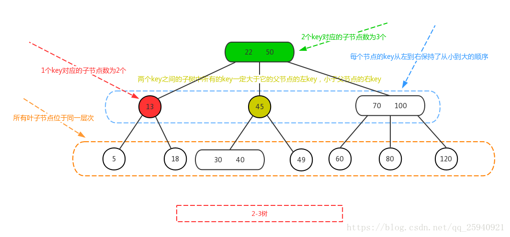
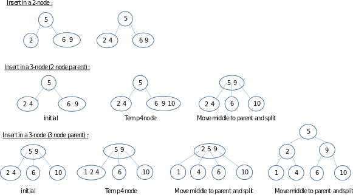

# 红黑树

红黑树是一颗近似平衡的二叉查找树，可以从 `2-3` 树或 `2-3-4` 树衍生而来。

通过对节点进行染色，`2-3` 树或 `2-3-4` 树的二叉树表示形式也就是红黑树。

其中 `2-3` 树实现的红黑树是普通红黑树的变种，称为左倾红黑树，

我们先介绍 `2-3` 树，再用二叉树形式来实现左倾红黑树，最后在介绍和实现 `2-3-4` 树和普通的红黑树。

## 一、`2-3` 树

### 1.1. `2-3` 树介绍

`2-3` 树是 `3阶的B树`，是一棵严格自平衡的多路查找树，由1986年图灵奖得主，美国理论计算机科学家 `John Edward Hopcroft` 在1970年发明。

它不是一棵二叉树。具有以下特征：

1. 内部节点要么有1个数据元素和2个孩子，要么有2个数据元素和3个孩子，叶子节点没有孩子，但有1或2个数据元素。
2. 所有叶子节点到根节点的长度一致。这个特征保证了完全平衡。
3. 每个节点的数据元素保持从小到大排序，两个数据元素之间的子树的所有值大小介于两个数据元素之间。

如图：

如果一个内部节点拥有一个数据元素、两个子节点，则此节点为2节点。

如果一个内部节点拥有两个数据元素、三个子节点，则此节点为3节点。

大部分的平衡树的核心都在于插入和删除逻辑，我们主要分析这两个操作。

### 1.2. `2-3` 树插入元素

在插入节点时，需要先找到插入的位置，然后再进行调整，使得满足 `2-3` 树的特征。有三种情况：

1. 插入元素到一个2节点，直接插入即可，这样节点变成3节点。
2. 插入元素到一个3节点，这种又分为两种情况，3节点的父亲是一个2节点还是3节点，需要做翻转调整。

如图（来自维基百科）：

核心在于插入3节点后，变成4节点，然后进行分裂。

### 1.3. `2-3` 树删除元素

## 二、 红黑树

