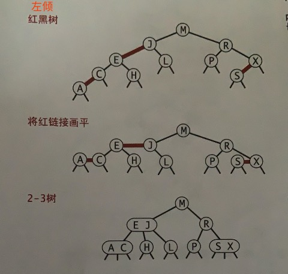
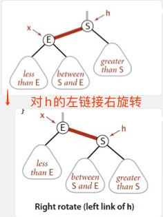
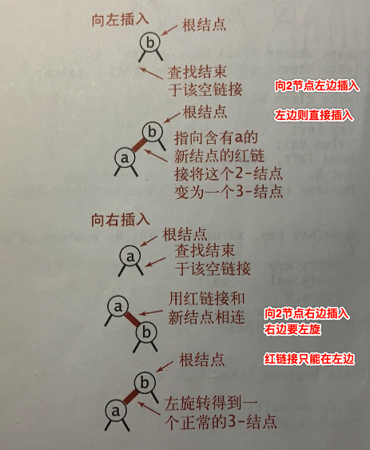

# 红黑树

某些教程不区分普通红黑树和左倾红黑树的区别，直接将左倾红黑树拿来教学，并且称其为红黑树，因为左倾红黑树与普通的红黑树相比，实现起来较为简单，容易教学。在这里，我们区分开左倾红黑树和普通红黑树。

红黑树是一种近似平衡的二叉查找树，从 `2-3` 树或 `2-3-4` 树衍生而来。通过对二叉树节点进行染色，染色为红或黑节点，来模仿 `2-3` 树或 `2-3-4` 树的3节点和4节点，从而让树的高度减小。

`2-3-4` 树对照实现的红黑树是普通的红黑树，而 `2-3` 树对照实现的红黑树是一种变种，称为左倾红黑树，其更容易实现。

我们先介绍 `2-3` 树，再用二叉树形式来实现 `2-3` 树，也就是左倾红黑树，最后介绍 `2-3-4` 树并实现普通的红黑树。

## 一、`2-3` 树

### 1.1. `2-3` 树介绍

`2-3` 树是一棵严格自平衡的多路查找树，由1986年图灵奖得主，美国理论计算机科学家 `John Edward Hopcroft` 在1970年发明，又称 `3阶的B树` (注：`B` 为 `Balance` 平衡的意思) 

它不是一棵二叉树，是一颗介于二叉树和三叉树之间的树。具有以下特征：

1. 内部节点要么有1个数据元素和2个孩子，要么有2个数据元素和3个孩子，叶子节点没有孩子，但有1或2个数据元素。
2. 所有叶子节点到根节点的长度一致。这个特征保证了完全平衡，非常完美的平衡。
3. 每个节点的数据元素保持从小到大排序，两个数据元素之间的子树的所有值大小介于两个数据元素之间。

因为 `2-3` 树的第二个特征，它是一颗完美平衡的树，所以树的高度非常的小。

如图：


如果一个内部节点拥有一个数据元素、两个子节点，则此节点为2节点。如果一个内部节点拥有两个数据元素、三个子节点，则此节点为3节点。

可以说，所有平衡树的核心都在于插入和删除逻辑，我们主要分析这两个操作。

### 1.2. `2-3` 树插入元素

在插入元素时，需要先找到插入的位置，使用二分查找从上自下查找树节点。

找到插入位置时，将元素插入该位置，然后进行调整，使得满足 `2-3` 树的特征。主要有三种情况：

1. 插入元素到一个2节点，直接插入即可，这样节点变成3节点。
2. 插入元素到一个3节点，该3节点的父亲是一个2节点，先将节点变成临时的4节点，然后向上分裂调整一次。
2. 插入元素到一个3节点，该3节点的父亲是一个3节点，先将节点变成临时的4节点，然后向上分裂调整，此时父亲节点变为临时4节点，继续向上分裂调整。

如图（来自维基百科）：


核心在于插入3节点后，该节点变为临时4节点，然后进行分裂恢复树的特征。最坏情况为插入节点后，每一次分裂后都导致上一层变为临时4节点，直到树根节点，这样需要不断向上分裂。

临时4节点的分裂，细分有六种情况，如图：


与其他二叉查找树由上而下生长不同，`2-3` 树是从下至上的生长。

### 1.3. `2-3` 树删除元素

待完成。

## 二、 左倾红黑树

### 2.1. 左倾红黑树介绍

左倾红黑树可以由 `2-3` 树的二叉树形式来实现。

其定义为：

1. 根节点的链接是黑色的。
2. 红链接均为左链接。
3. 没有任何一个结点同时和两条红链接相连
4. 该树是完美黑色平衡的，即任意空链接到根节点的路径上的黑链接数量相同。

由于红链接都在左边，所以这种红黑树又称左倾红黑树。左倾红黑树与 `2-3` 树一一对应，只要将左链接画平，如图：



### 2.2. 节点旋转和颜色转换

首先，我们要定义树的结构 `LLRBTree` ，以及表示左倾红黑树的节点 `LLRBTNode`：

```go
// 定义颜色
const (
	RED   = true
	BLACK = false
)

// 左倾红黑树
type LLRBTree struct {
	Root *LLRBTNode // 树根节点
}


// 左倾红黑树节点
type LLRBTNode struct {
	Value       int64     // 值
	Times       int64      // 值出现的次数
	Left        *LLRBTNode // 左子树
	Right       *LLRBTNode // 右子树
	Color       bool       // 父亲指向该节点的链接颜色
}

// 新建一颗空树
func NewLLRBTree() *LLRBTree {
	return &LLRBTree{}
}

// 左链接的颜色
func IsRed(node *LLRBTNode) bool {
	if node == nil {
		return false
	}
	return node.Color == RED
}

```

在节点 `LLRBTNode` 中，我们存储的元素字段为 `Value`，由于可能有重复的元素插入，所以多了一个 `Times` 字段，表示该元素出现几次。

当然，红黑树中的红黑颜色使用 `Color` 定义，表示父亲指向该节点的链接颜色。为了方便，我们还构造了一个辅助函数 `IsRed()`。

在元素添加和实现的过程中，需要做调整操作，有两种旋转操作，对某节点的右链接进行左旋转，或者左链接进行右旋转。

如图是对节点 `h` 的右链接进行左旋转：


代码实现如下：

```go
// 左旋转
func RotateLeft(h *LLRBTNode) *LLRBTNode {
	if h == nil {
		return nil
	}

	// 看图理解
	x := h.Right
	h.Right = x.Left
	x.Left = h
	x.Color = h.Color
	h.Color = RED
	return x
}
```

如图是对节点 `h` 的左链接进行右旋转：



代码实现如下：

```go
// 右旋转
func RotateRight(h *LLRBTNode) *LLRBTNode {
	if h == nil {
		return nil
	}

	// 看图理解
	x := h.Left
	h.Left = x.Right
	x.Right = h
	x.Color = h.Color
	h.Color = RED
	return x
}
```

由于左倾红黑树不允许一个节点有两个红链接，所以需要做颜色转换，如图：


代码如下：

```go
// 颜色转换
func ColorChange(h *LLRBTNode) {
	if h == nil {
		return
	}
	h.Color = !h.Color
	h.Left.Color = !h.Left.Color
	h.Right.Color = !h.Right.Color
}
```

旋转和颜色转换作为局部调整，并不影响全局。

### 2.3. 添加元素实现

每次添加元素节点时，都将该节点 `Color` 字段，也就是父亲指向它的链接设置为 `RED` 红色。

接着判断其父亲是否有两个红链接，或者有右红色链接，进行颜色变换或旋转操作。

主要有以下这几种情况。

插入元素到2节点，直接让节点变为3节点，不过当右插入时需要左旋使得红色链接在左边，如图：



插入元素到3节点，需要做旋转和颜色转换操作，如图：


也就是说，在一个已经是红色左链接的节点，插入一个新节点的状态变化如下：


根据上述的演示图以及旋转，颜色转换等操作，添加元素的代码为：

```go
// 左倾红黑树添加元素
func (tree *LLRBTree) Add(value int64) {
	// 跟节点开始添加元素，因为可能调整，所以需要将返回的节点赋值回根节点
	tree.Root = tree.Root.Add(value)
	// 根节点的链接永远都是黑色的
	tree.Root.Color = BLACK
}

// 往节点添加元素
func (node *LLRBTNode) Add(value int64) *LLRBTNode {
	// 插入的节点为空，将其链接颜色设置为红色，并返回
	if node == nil {
		return &LLRBTNode{
			Value: value,
			Color: RED,
		}
	}

	// 插入的元素重复
	if value == node.Value {
		node.Times = node.Times + 1
	} else if value > node.Value {
		// 插入的元素比节点值大，往右子树插入
		node.Right = node.Right.Add(value)
	} else {
		// 插入的元素比节点值小，往左子树插入
		node.Left = node.Left.Add(value)
	}

	// 辅助变量
	nowNode := node

	// 右链接为红色，那么进行左旋，确保树是左倾的
	if IsRed(nowNode.Right) && !IsRed(nowNode.Left) {
		nowNode = RotateLeft(nowNode)
	} else {
		// 连续两个左链接为红色，那么进行右旋
		if IsRed(nowNode.Left) && IsRed(nowNode.Left.Left) {
			nowNode = RotateRight(nowNode)
		}

		// 旋转后，可能左右链接都为红色，需要变色
		if IsRed(nowNode.Left) && IsRed(nowNode.Right) {
			ColorChange(nowNode)
		}
	}

	return nowNode
}
```

### 2.4. 时间复杂度分析

可参考论文： [Left-leaning Red-Black Trees](https://www.cs.princeton.edu/~rs/talks/LLRB/LLRB.pdf)。

通过随机构造左倾红黑树，经过实验，左倾红黑树的平均树高度为 `2log(n)`，其中 `n` 为树的节点数量，而 `AVL` 树的最坏树高度为 `1.44log(n)`。

由于左倾红黑树是近似平衡的二叉树，没有 `AVL` 树的严格平衡，树的高度会更高一点，因此查找操作效率更低，但时间复杂度只在于常数项的差别，去掉常数项，时间复杂度仍然是 `log(n)`。

我们的代码实现中，左倾红黑树的插入，需要逐层判断是否需要旋转，复杂度为 `log(n)`，可能旋转和染色多次（当旋转变色后导致上层存在连续的红左链接），但我们可以继续优化代码，使得在某一层旋转变色后，如果其父层没有连续的左红链接，那么可以直接退出，复杂度变为常数 `c`。

对于 `AVL` 树来说，插入最多旋转两次，但其需要逐层更新树高度，复杂度为 `log(n)`。按照效率来说，左倾红黑树插入效率会稍微好一点。

### 2.5. 删除元素实现

待完成。

### 2.6. 查找元素等实现

查找最小值，最大值，或者某个值，代码如下：

```go
// 找出最小值的节点
func (tree *LLRBTree) FindMinValue() *LLRBTNode {
	if tree.Root == nil {
		// 如果是空树，返回空
		return nil
	}

	return tree.Root.FindMinValue()
}

func (node *LLRBTNode) FindMinValue() *LLRBTNode {
	// 左子树为空，表面已经是最左的节点了，该值就是最小值
	if node.Left == nil {
		return node
	}

	// 一直左子树递归
	return node.Left.FindMinValue()
}

// 找出最大值的节点
func (tree *LLRBTree) FindMaxValue() *LLRBTNode {
	if tree.Root == nil {
		// 如果是空树，返回空
		return nil
	}

	return tree.Root.FindMaxValue()
}

func (node *LLRBTNode) FindMaxValue() *LLRBTNode {
	// 右子树为空，表面已经是最右的节点了，该值就是最大值
	if node.Right == nil {
		return node
	}

	// 一直右子树递归
	return node.Right.FindMaxValue()
}

// 查找指定节点
func (tree *LLRBTree) Find(value int64) *LLRBTNode {
	if tree.Root == nil {
		// 如果是空树，返回空
		return nil
	}

	return tree.Root.Find(value)
}

func (node *LLRBTNode) Find(value int64) *LLRBTNode {
	if value == node.Value {
		// 如果该节点刚刚等于该值，那么返回该节点
		return node
	} else if value < node.Value {
		// 如果查找的值小于节点值，从节点的左子树开始找
		if node.Left == nil {
			// 左子树为空，表示找不到该值了，返回nil
			return nil
		}
		return node.Left.Find(value)
	} else {
		// 如果查找的值大于节点值，从节点的右子树开始找
		if node.Right == nil {
			// 右子树为空，表示找不到该值了，返回nil
			return nil
		}
		return node.Right.Find(value)
	}
}

// 中序遍历
func (tree *LLRBTree) MidOrder() {
	tree.Root.MidOrder()
}

func (node *LLRBTNode) MidOrder() {
	if node == nil {
		return
	}

	// 先打印左子树
	node.Left.MidOrder()

	// 按照次数打印根节点
	for i := 0; i <= int(node.Times); i++ {
		fmt.Println(node.Value)
	}

	// 打印右子树
	node.Right.MidOrder()
}
```

查找操作逻辑与通用的二叉查找树一样，并无区别。

### 2.7. 完整程序

```go
package main

import "fmt"

// 左倾红黑树实现
// Left-leaning red-black tree

// 定义颜色
const (
	RED   = true
	BLACK = false
)

// 左倾红黑树
type LLRBTree struct {
	Root *LLRBTNode // 树根节点
}

// 新建一颗空树
func NewLLRBTree() *LLRBTree {
	return &LLRBTree{}
}

// 左倾红黑树节点
type LLRBTNode struct {
	Value int64      // 值
	Times int64      // 值出现的次数
	Left  *LLRBTNode // 左子树
	Right *LLRBTNode // 右子树
	Color bool       // 父亲指向该节点的链接颜色
}

// 左链接的颜色
func IsRed(node *LLRBTNode) bool {
	if node == nil {
		return false
	}
	return node.Color == RED
}

// 左旋转
func RotateLeft(h *LLRBTNode) *LLRBTNode {
	if h == nil {
		return nil
	}

	// 看图理解
	x := h.Right
	h.Right = x.Left
	x.Left = h
	x.Color = h.Color
	h.Color = RED
	return x
}

// 右旋转
func RotateRight(h *LLRBTNode) *LLRBTNode {
	if h == nil {
		return nil
	}

	// 看图理解
	x := h.Left
	h.Left = x.Right
	x.Right = h
	x.Color = h.Color
	h.Color = RED
	return x
}

// 颜色转换
func ColorChange(h *LLRBTNode) {
	if h == nil {
		return
	}
	h.Color = !h.Color
	h.Left.Color = !h.Left.Color
	h.Right.Color = !h.Right.Color
}

// 左倾红黑树添加元素
func (tree *LLRBTree) Add(value int64) {
	// 跟节点开始添加元素，因为可能调整，所以需要将返回的节点赋值回根节点
	tree.Root = tree.Root.Add(value)
	// 根节点的链接永远都是黑色的
	tree.Root.Color = BLACK
}

// 往节点添加元素
func (node *LLRBTNode) Add(value int64) *LLRBTNode {
	// 插入的节点为空，将其链接颜色设置为红色，并返回
	if node == nil {
		return &LLRBTNode{
			Value: value,
			Color: RED,
		}
	}

	// 插入的元素重复
	if value == node.Value {
		node.Times = node.Times + 1
	} else if value > node.Value {
		// 插入的元素比节点值大，往右子树插入
		node.Right = node.Right.Add(value)
	} else {
		// 插入的元素比节点值小，往左子树插入
		node.Left = node.Left.Add(value)
	}

	// 辅助变量
	nowNode := node

	// 右链接为红色，那么进行左旋，确保树是左倾的
	if IsRed(nowNode.Right) && !IsRed(nowNode.Left) {
		nowNode = RotateLeft(nowNode)
	} else {
		// 连续两个左链接为红色，那么进行右旋
		if IsRed(nowNode.Left) && IsRed(nowNode.Left.Left) {
			nowNode = RotateRight(nowNode)
		}

		// 旋转后，可能左右链接都为红色，需要变色
		if IsRed(nowNode.Left) && IsRed(nowNode.Right) {
			ColorChange(nowNode)
		}
	}

	return nowNode
}

// 找出最小值的节点
func (tree *LLRBTree) FindMinValue() *LLRBTNode {
	if tree.Root == nil {
		// 如果是空树，返回空
		return nil
	}

	return tree.Root.FindMinValue()
}

func (node *LLRBTNode) FindMinValue() *LLRBTNode {
	// 左子树为空，表面已经是最左的节点了，该值就是最小值
	if node.Left == nil {
		return node
	}

	// 一直左子树递归
	return node.Left.FindMinValue()
}

// 找出最大值的节点
func (tree *LLRBTree) FindMaxValue() *LLRBTNode {
	if tree.Root == nil {
		// 如果是空树，返回空
		return nil
	}

	return tree.Root.FindMaxValue()
}

func (node *LLRBTNode) FindMaxValue() *LLRBTNode {
	// 右子树为空，表面已经是最右的节点了，该值就是最大值
	if node.Right == nil {
		return node
	}

	// 一直右子树递归
	return node.Right.FindMaxValue()
}

// 查找指定节点
func (tree *LLRBTree) Find(value int64) *LLRBTNode {
	if tree.Root == nil {
		// 如果是空树，返回空
		return nil
	}

	return tree.Root.Find(value)
}

func (node *LLRBTNode) Find(value int64) *LLRBTNode {
	if value == node.Value {
		// 如果该节点刚刚等于该值，那么返回该节点
		return node
	} else if value < node.Value {
		// 如果查找的值小于节点值，从节点的左子树开始找
		if node.Left == nil {
			// 左子树为空，表示找不到该值了，返回nil
			return nil
		}
		return node.Left.Find(value)
	} else {
		// 如果查找的值大于节点值，从节点的右子树开始找
		if node.Right == nil {
			// 右子树为空，表示找不到该值了，返回nil
			return nil
		}
		return node.Right.Find(value)
	}
}

// 中序遍历
func (tree *LLRBTree) MidOrder() {
	tree.Root.MidOrder()
}

func (node *LLRBTNode) MidOrder() {
	if node == nil {
		return
	}

	// 先打印左子树
	node.Left.MidOrder()

	// 按照次数打印根节点
	for i := 0; i <= int(node.Times); i++ {
		fmt.Println(node.Value)
	}

	// 打印右子树
	node.Right.MidOrder()
}

func main() {
	tree := NewLLRBTree()
	values := []int64{2, 3, 7, 10, 10, 10, 10, 23, 9, 102, 109, 111, 112, 113, 115, 18}
	for _, v := range values {
		tree.Add(v)
	}

	// 找到最大值或最小值的节点
	fmt.Println("find min value:", tree.FindMinValue())
	fmt.Println("find max value:", tree.FindMaxValue())

	// 查找不存在的99
	node := tree.Find(99)
	if node != nil {
		fmt.Println("find it 99!")
	} else {
		fmt.Println("not find it 99!")
	}

	// 查找存在的9
	node = tree.Find(9)
	if node != nil {
		fmt.Println("find it 9!")
	} else {
		fmt.Println("not find it 9!")
	}

	tree.MidOrder()
}

```

运行：

```go
find min value: &{2 0 <nil> <nil> false}
find max value: &{115 0 <nil> <nil> false}
not find it 99!
find it 9!
2
3
7
9
10
10
10
10
18
23
102
109
111
112
113
115
```

## 三、 `2-3-4` 树

### 3.1. `2-3-4` 树介绍

### 3.2. `2-3-4` 树插入元素

### 3.3. `2-3-4` 树删除元素

## 四、 普通红黑树

### 4.1. 普通红黑树介绍

### 4.2. 添加元素实现

### 4.2. 删除元素实现

### 4.3. 其他操作实现

### 4.4. 完整程序
