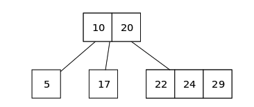
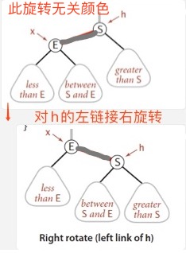
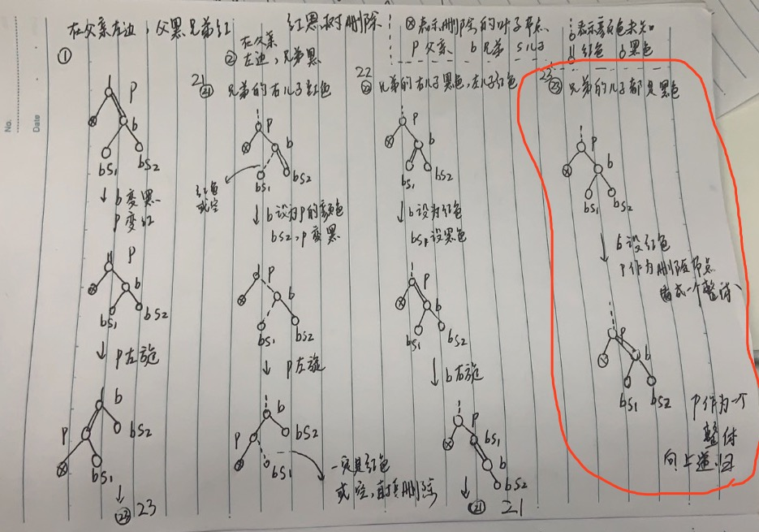
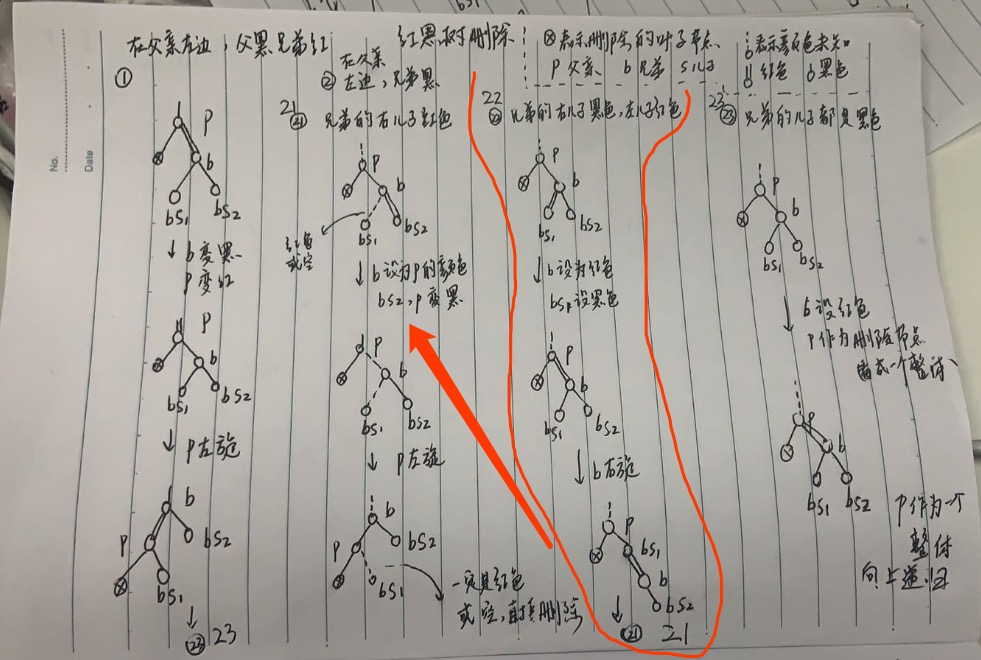

# 2-3-4树和普通红黑树

某些教程不区分普通红黑树和左倾红黑树的区别，直接将左倾红黑树拿来教学，并且称其为红黑树，因为左倾红黑树与普通的红黑树相比，实现起来较为简单，容易教学。在这里，我们区分开左倾红黑树和普通红黑树。

红黑树是一种近似平衡的二叉查找树，从 `2-3` 树或 `2-3-4` 树衍生而来。通过对二叉树节点进行染色，染色为红或黑节点，来模仿 `2-3` 树或 `2-3-4` 树的3节点和4节点，从而让树的高度减小。`2-3-4` 树对照实现的红黑树是普通的红黑树，而 `2-3` 树对照实现的红黑树是一种变种，称为左倾红黑树，其更容易实现。

使用平衡树数据结构，可以提高查找元素的速度，我们在本章介绍 `2-3-4` 树，再用二叉树形式来实现 `2-3-4` 树，也就是普通的红黑树。

## 一、`2-3-4` 树

### 1.1. `2-3-4` 树介绍

`2-3-4` 树是一棵严格自平衡的多路查找树，又称 `4阶的B树` (注：`B` 为 `Balance` 平衡的意思) 

它不是一棵二叉树，是一棵四叉树。具有以下特征：

1. 内部节点要么有1个数据元素和2个孩子，要么有2个数据元素和3个孩子，要么有3个数据元素和4个孩子，叶子节点没有孩子，但有1，2或3个数据元素。
2. 所有叶子节点到根节点的长度一致。这个特征保证了完全平衡，非常完美的平衡。
3. 每个节点的数据元素保持从小到大排序，两个数据元素之间的子树的所有值大小介于两个数据元素之间。

因为 `2-3-4` 树的第二个特征，它是一棵完美平衡的树，非常完美，除了叶子节点，其他的节点都没有空儿子，所以树的高度非常的小。

如图：




如果一个内部节点拥有一个数据元素、两个子节点，则此节点为2节点。如果一个内部节点拥有两个数据元素、三个子节点，则此节点为3节点。如果一个内部节点拥有三个数据元素、四个子节点，则此节点为4节点。

可以说，所有平衡树的核心都在于插入和删除逻辑，我们主要分析这两个操作。

### 1.2. `2-3-4` 树插入元素

在插入元素时，需要先找到插入的位置，使用二分查找从上自下查找树节点。

找到插入位置时，将元素插入该位置，然后进行调整，使得满足 `2-3-4` 树的特征。主要有三种情况：

1. 插入元素到一个2节点或3节点，直接插入即可，这样节点变成3节点或4节点。
2. 插入元素到一个4节点，该4节点的父亲不是一个4节点，将4节点的中间元素提到父节点，原4节点变成两个2节点，再将元素插入到其中一个2节点。
3. 插入元素到一个4节点，该4节点的父亲是一个4节点，也是将4节点的中间元素提到父节点，原4节点变成两个2节点，再将元素插入到其中一个2节点。当中间元素提到父节点时，父节点也是4节点，可以递归向上操作。

核心在于往4节点插入元素时，需要将4节点中间元素提升，4节点变为两个2节点后，再插入元素，如图：


下面演示插入元素到一个4节点：


与其他二叉查找树由上而下生长不同，`2-3-4` 树是从下至上的生长。

`2-3-4` 树因为节点元素数量的增加，情况变得更复杂，下面是插入元素到一个4节点，而4节点的父节点是3节点的三种情况：


其他情况可以参考 `2-3树和左倾红黑树` 一章，非常相似，在此不再赘述。

### 1.3. `2-3-4` 树删除元素

删除操作就复杂得多了，请耐心阅读理解，和 `2-3` 树删除元素类似。

`2-3-4` 树的特征注定它是一棵非常完美平衡的四叉树，其所有子树也都是完美平衡，所以 `2-3-4` 树的某节点的儿子，要么都是空儿子，要么都不是空儿子。比如 `2-3-4` 树的某个节点 `A` 有两个儿子 `B` 和 `C`，儿子 `B` 和 `C` 要么都没有孩子，要么孩子都是满的，不然 `2-3-4` 树所有叶子节点到根节点的长度一致这个特征就被破坏了。

基于上面的现实，我们来分析删除的不同情况，删除中间节点和叶子节点。

情况1：删除中间节点

删除的是非叶子节点，该节点一定是有两棵，三棵或者四棵子树的，那么从子树中找到其最小后继节点，该节点是叶子节点，用该节点替换被删除的非叶子节点，然后再删除这个叶子节点，进入情况2。

如何找到最小后继节点，当有两棵子树时，那么从右子树一直往左下方找，如果有三棵子树，被删除节点在左边，那么从中子树一直往左下方找，否则从右子树一直往左下方找。如果有四棵子树，那么往被删除节点右边的子树，一直往左下方找。

情况2：删除叶子节点

删除的是叶子节点，这时叶子节点如果是4节点，直接变为3节点，如果是3节点，那么直接变为2节点即可，不影响平衡。但是，如果叶子节点是2节点，那么删除后，其父节点将会缺失一个儿子，破坏了满孩子的 `2-3-4` 树特征，需要进行调整后才能删除。

针对情况2，删除一个2节点的叶子节点，会导致父节点缺失一个儿子，破坏了 `2-3-4` 树的特征，我们可以进行调整变换，主要有两种调整：

1. 重新分布：尝试从兄弟节点那里借值，然后重新调整节点。
2. 合并：如果兄弟借不到值，合并节点（与父亲的元素）。

如果被删除的叶子节点有兄弟是3节点或4节点，可以向最近的兄弟借值，然后重新分布，这样叶子节点就不再是2节点了，删除元素后也不会破坏平衡。如图：


与兄弟借值，兄弟必须有多余的元素可以借，借的过程中需要和父节点元素重新分布位置，确保符合元素大小排序的正确。

如果被删除的叶子节点，兄弟都是2节点，而父亲是3节点或4节点，那么将父亲的一个元素拉下来进行合并（当父节点是3节点时，父亲元素与被删除节点合并成3节点，当父节点是4节点时，被删除节点和其最近的兄弟，以及父亲的一个元素合并成一个4节点），父亲变为2节点或3节点，这时叶子节点就不再是2节点了，删除元素后也不会破坏平衡。如图：


有一种最特殊的情况，也就是被删除的叶子节点，兄弟都是2节点，父亲也是2节点，这种情况没法向兄弟借，也没法和父亲合并，与父亲合并后父亲就变空了。幸运的是，这种特殊情况只会发生在根节点是其父节点的情况，如图：


因为 `2-3-4` 树的性质，除了根节点，其他节点不可能出现其本身和儿子都是2节点。

`2-3-4` 树的实现将会放在 `B树` 章节，我们将会实现其二叉树形式的普通红黑树结构。

## 二、 普通红黑树

### 2.1. 普通红黑树介绍

普通红黑树可以由 `2-3-4` 树的二叉树形式来实现。

其定义为：

1. 根节点的链接是黑色的。
2. 每个红色节点都必须有两个黑色子节点。
3. 任意节点到根节点的路径上的黑链接数量相同。也就是该树是完美黑色平衡的。

普通红黑树与其变种：左倾红黑树的区别是，它允许右倾的红色节点，不再限制左倾，但仍然不能有连续的两个左倾红色链接。

每一棵 `2-3-4` 树可以对应多棵普通红黑树，如图：
 


区别：`2-3` 树与左倾红黑树则是一一对应，而 `2-3-4` 树可以对应多棵普通红黑树，是因为它允许了红链接右倾。

### 2.2. 结构定义和节点旋转

首先，我们要定义树的结构 `RBTree` ，以及表示普通红黑树的节点 `RBTNode`：

```go
// 定义颜色
const (
	RED   = true
	BLACK = false
)

// 普通红黑树
type RBTree struct {
	Root *RBTNode // 树根节点
}

// 新建一棵空树
func NewRBTree() *RBTree {
	return &RBTree{}
}

// 普通红黑树节点
type RBTNode struct {
	Value int64    // 值
	Times int64    // 值出现的次数
	Left  *RBTNode // 左子树
	Right *RBTNode // 右子树
	Color bool     // 父亲指向该节点的链接颜色
}
```

在节点 `RBTNode` 中，我们存储的元素字段为 `Value`，由于可能有重复的元素插入，所以多了一个 `Times` 字段，表示该元素出现几次。

当然，红黑树中的红黑颜色使用 `Color` 定义，表示父亲指向该节点的链接颜色。

在元素添加和实现的过程中，需要做调整操作，有两种旋转操作，对某节点的右链接进行左旋转，如图：


代码如下：

```go
// 左旋转
func RotateLeft(h *RBTNode) *RBTNode {
	if h == nil {
		return nil
	}

	// 看图理解
	x := h.Right
	h.Right = x.Left
	x.Left = h
	return x
}
```

或者左链接进行右旋转，如图：



代码如下：

```go
// 右旋转
func RotateRight(h *RBTNode) *RBTNode {
	if h == nil {
		return nil
	}

	// 看图理解
	x := h.Left
	h.Left = x.Right
	x.Right = h
	return x
}
```

旋转作为局部调整，并不影响全局。

旋转后可能需要对某些节点进行变色处理：

```go
// 设置节点颜色
func SetColor(node *RBTNode, color bool) {
	if node != nil {
		node.Color = color
	}
}
```

可以继续查看下面的内容。

### 2.3. 添加元素实现

每次添加元素节点时，都将该节点 `Color` 字段，也就是父亲指向它的链接设置为 `RED` 红色。

总结情况如下：


情况1：空树，那么插入节点直接变为根节点。

情况2：父节点是黑节点，直接插入即可，不破坏红黑树特征。

情况3：父节点是红节点，叔叔节点也是红节点，这时对应 `2-3-4` 树的4节点，插入后变成了5节点，破坏了平衡，直接将祖父节点变色即可，然后向上递归处理，相当于 `2-3-4` 树的4节点提升，如图：


情况4：父节点是红节点，没有叔叔或者叔叔是黑节点，插入后出现了两个连续的红链接，需要进行旋转调整，如图：


如果是顺方向连续红链接，旋转一次即可，否则需要左右旋转或者右左旋转，旋转两次。

这次我们使用非递归的形式，效率会更高（可及时跳出循环），代码实现如下：

```go

jj
```

### 2.4. 添加元素算法分析

当父亲是红节点，叔叔为空或是黑节点时，插入最多旋转两次就恢复了平衡。而如果父亲和叔叔都是红节点，那么祖父变色之后可能需要一直递归向上处理，直到根节点，但是，只要出现了旋转，仍然是最多旋转两次就树平衡了。

最坏情况的红黑树高度为 `2log(n)`（证明略），查找到插入的位置最坏情况查找 `2log(n)` 次，然后进行调整，最坏情况递归到根节点，递归 `2log(n)` 次（构造最坏情况的树很难），去掉常数，添加元素的平均时间复杂度仍然为 `log(n)`，而旋转最多两次。

### 2.5. 删除元素实现

删除操作就复杂得多了。对照一下 `2-3-4` 树。

1. 情况1：如果删除的是非叶子节点，找到其最小后驱节点，也就是在其右子树中一直向左找，找到的该叶子节点替换被删除的节点，然后删除该叶子节点，变成情况2。
2. 情况2：如果删除的是叶子节点，如果它是红节点，也就是父亲指向它的链接为红色，那么直接删除即可。否则，我们需要进行调整，使它变为红节点，再删除。

针对情况2，如果删除的叶子节点是红节点，那它对应 `2-3-4` 树的3节点或4节点，直接删除即可，删除后变为了2节点或3节点。否则，它是一个2节点，删除后破坏了平衡，要么向兄弟借值，要么和父亲的一个元素合并。

删除的叶子节点是黑色的，才需要向兄弟借值，或与父亲合并，有以下几种情况：

删除的叶子节点在父亲的左边：


图例中 `21`， `22` 相当于向兄弟借值，而 `1` 和 `24` 相当于向父亲的一个值合并后调整。

我们仔细分析一下：

图例 `1`，当删除的叶子节点在父亲左边，而兄弟是红色节点，我们可以知道父亲和兄弟的儿子绝对都是黑节点，将兄弟变黑，父亲变红，然后对父亲右链接左旋。如图：


这时调整后变为了图例 `24`，这种情况实际上是在 `2-3-4` 树中和父亲的值合并，只不过将父亲的值转了一个方向，变为图例 `24` 好分析。

图例 `24`，当删除的叶子节点在父亲左边，兄弟节点是黑色，兄弟的儿子们也都是黑色，相当于 `2-3-4` 树和兄弟借不到值了，需要将兄弟变为红色，然后将父亲作为一个整体来删除，向上递归处理（相当于拉了父亲的一个值和兄弟合并）。如图：



图例 `21` 和 `21` 就简单了，相当 `2-3-4` 树与兄弟借值。

图例 `21`，当删除的叶子节点在父亲左边，且兄弟是黑色，而兄弟的右儿子是红色，那么兄弟设置成父亲的颜色，兄弟的右儿子和父亲变黑，接着对父亲进行左旋，旋转后可以直接删除元素。如图：


图例 `22`，当删除的叶子节点在父亲左边，且兄弟是黑色，而兄弟的右儿子是黑色，左儿子是红色，将兄弟设置为红色，兄弟的左儿子设置为黑色，对兄弟进行右旋，变为图例 `21`。如图：



当然，删除的叶子节点可以在父亲的右边（与上述的图反方向）：


类似于删除的叶子节点在父亲的左边，在此不再分析。

上面的图例，我们其实可以将其画出 `2-3-4` 树的形式，会更容易理解，在此就不画出了。

这次我们使用非递归的形式，效率会更高（可及时跳出循环），代码实现如下：

```go
jjj
```

### 2.6. 删除元素算法分析

删除元素比左倾红黑树的情况还要多，但是平均时间复杂度仍然是 `log(n)`，出现在和兄弟借不到值的情况下向上递归。和 AVL树区别是，删除元素最多旋转两次，不需要旋转到根节点。

### 2.7. 查找元素等实现

略。与左倾红黑树，AVL树都一样。

### 2.8. 完整程序

## 三、应用场景

红黑树可以用来作为字典 `Map` 的基础数据结构，可以存储键值对，然后通过一个键，可以快速找到键对应的值，相比哈希表查找，不需要占用额外的空间。我们以上的代码实现只有 `value`，没有 `key:value`，可以简单改造实现字典。 

`Java` 语言基础类库中的 `HashMap`，`TreeSet`，`TreeMap` 都有使用到，`C++` 语言的 `STL` 标准模板库中，`map` 和 `set` 类也有使用到。很多中间件也有使用到，比如 `Nginx`，但 `Golang` 语言标准库并没有它。