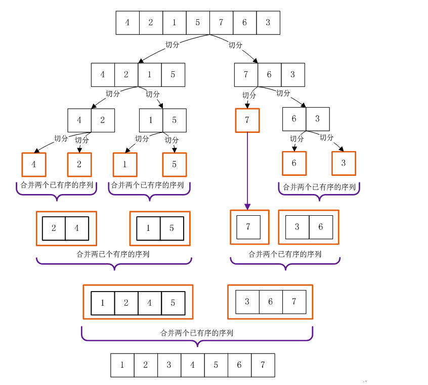

# 归并排序

归并排序是一种分治策略的排序算法。它是一种比较特殊的排序，通过递归地先使每个子序列有序，再将两个有序的序列进行合并成一个有序的序列。

## 一、算法介绍

我们先介绍两个有序的数组合并成一个有序数组的操作。

1. 先申请一个辅助数组，长度等于两个有序数组长度的和。
2. 从两个有序数组的第一位开始，比较两个元素，哪个数组的元素更小，那么该元素添加进辅助数组，然后该数组的元素变更为下一位，继续重复这个操作，直至数组没有元素。
3. 返回辅助数组。

举一个例子：

````
有序数组A：[3 8 9 11 13]
有序数组B：[1 5 8 10 17 19 20 23]
[] 表示比较的范围。

因为 1 < 3，所以 1 加入辅助数组
有序数组A：[3 8 9 11 13]
有序数组B：1 [5 8 10 17 19 20 23] 
辅助数组：1

因为 3 < 5，所以 3 加入辅助数组
有序数组A：3 [8 9 11 13]
有序数组B：1 [5 8 10 17 19 20 23] 
辅助数组：1 3

因为 5 < 8，所以 5 加入辅助数组
有序数组A：3 [8 9 11 13]
有序数组B：1 5 [8 10 17 19 20 23] 
辅助数组：1 3 5

因为 8 == 8，所以 两个数都 加入辅助数组
有序数组A：3 8 [9 11 13]
有序数组B：1 5 8 [10 17 19 20 23] 
辅助数组：1 3 5 8 8

因为 9 < 10，所以 9 加入辅助数组
有序数组A：3 8 9 [11 13]
有序数组B：1 5 8 [10 17 19 20 23] 
辅助数组：1 3 5 8 8 9

因为 10 < 11，所以 10 加入辅助数组
有序数组A：3 8 9 [11 13]
有序数组B：1 5 8 10 [17 19 20 23] 
辅助数组：1 3 5 8 8 9 10

因为 11 < 17，所以 11 加入辅助数组
有序数组A：3 8 9 11 [13]
有序数组B：1 5 8 10 [17 19 20 23] 
辅助数组：1 3 5 8 8 9 10 11

因为 13 < 17，所以 13 加入辅助数组
有序数组A：3 8 9 11 13
有序数组B：1 5 8 10 [17 19 20 23] 
辅助数组：1 3 5 8 8 9 10 11 13

因为数组A已经没有比较元素，将数组B剩下的元素拼接在辅助数组后面。

结果：1 3 5 8 8 9 10 11 13 17 19 20 23
````

将两个有序数组进行合并，最多进行 `n` 次比较就可以生成一个新的有序数组，`n` 是两个数组长度较大的那个。

最坏的时间复杂度为：`O(n)`，其中 `n` 是较长数组的长度。最好的时间复杂度为：`O(n)`，其中 `n` 是较短数组的长度。正是利用这个特点，归并排序先排序较小的数组，再将有序的小数组合并形成更大有序的数组。

归并排序有两种递归做法，一种是自顶向下，一种是自底向上。

### 1.1. 自顶向下归并排序

从一个大数组开始，不断地往下切分，如图：



从上往下进行递归，直到切分的小数组无法切分了，然后不断地对这些有序数组进行合并。

每次都是一分为二，特别均匀，所以最差和最坏时间复杂度都一样。归并操作的时间复杂度为：`O(n)`，因此总的时间复杂度为：`T(n)=2T(n/2)+O(n)`，根据主定理公式可以知道时间复杂度为：`O(nlogn)`。我们可以自己计算一下：

```
归并排序，每次归并操作比较的次数为两个有序数组的长度： n/2

T(n) = 2*T(n/2) + n/2
T(n/2) = 2*T(n/4) + n/4
T(n/4) = 2*T(n/8) + n/8
T(n/8) = 2*T(n/16) + n/16
...
T(4) = 2*T(2) + 4
T(2) = 2*T(1) + 2
T(1) = 1

进行合并也就是：

T(n) = 2*T(n/2) + n/2
     = 2^2*T(n/4)+ n/2 + n/2
     = 2^3*T(n/8) + n/2 + n/2 + n/2
     = 2^4*T(n/16) + n/2 + n/2 + n/2 + n/2
     = ...
     = 2^logn*T(1) + logn * n/2
     = 2^logn + 1/2*nlogn
     = n + 1/2*nlogn

因为当问题规模 n 趋于无穷大时 nlogn 比 n 大，所以 T(n) = O(nlogn)。

因此时间复杂度为：O(nlogn)。
```

因为不断地递归，程序栈层数会有 `logn` 层，所以递归栈的空间复杂度为：`O(logn)`，对于排序十亿个整数，也只要：`log(100 0000 0000)=29.897`，占用的堆栈层数最多 `30` 层，所以栈溢出这种情况不需要担忧。

### 1.2. 自底向上归并排序

从小数组开始排序，不断地合并形成更大的有序数组。


时间复杂度和自顶向上归并排序一样，也都是 `O(nlogn)`。

因为不需要使用递归，没有程序栈占用，因此递归栈的空间复杂度为：`O(1)`。

## 二、算法实现

自顶向下的归并排序递归实现：

```go
package main

import "fmt"

// 自顶向下归并排序，排序范围在 [begin,end) 的数组
func MergeSort(array []int, begin int, end int) {
	// 元素数量大于1时才进入递归
	if end-begin > 1 {

		// 将数组一分为二，分为 array[begin,mid) 和 array[mid,high)
		mid := begin + (end-begin+1)/2

		// 先将左边排序好
		MergeSort(array, begin, mid)

		// 再将右边排序好
		MergeSort(array, mid, end)

		// 两个有序数组进行合并
		merge(array, begin, mid, end)
	}
}

// 归并操作
func merge(array []int, begin int, mid int, end int) {
	// 申请额外的空间来合并两个有序数组，这两个数组是 array[begin,mid),array[mid,end)
	leftSize := mid - begin         // 左边数组的长度
	rightSize := end - mid          // 右边数组的长度
	newSize := leftSize + rightSize // 辅助数组的长度
	result := make([]int, 0, newSize)

	l, r := 0, 0
	for l < leftSize && r < rightSize {
		lValue := array[begin+l] // 左边数组的元素
		rValue := array[mid+r]   // 右边数组的元素
		// 小的元素先放进辅助数组里
		if lValue < rValue {
			result = append(result, lValue)
			l++
		} else {
			result = append(result, rValue)
			r++
		}
	}

	// 将剩下的元素追加到辅助数组后面
	result = append(result, array[begin+l:mid]...)
	result = append(result, array[mid+r:end]...)

	// 将辅助数组的元素复制回原数组，这样该辅助空间就可以被释放掉
	for i := 0; i < newSize; i++ {
		array[begin+i] = result[i]
	}
	return
}

func main() {
	list := []int{5}
	MergeSort(list, 0, len(list))
	fmt.Println(list)

	list1 := []int{5, 9}
	MergeSort(list1, 0, len(list1))
	fmt.Println(list1)

	list2 := []int{5, 9, 1, 6, 8, 14, 6, 49, 25, 4, 6, 3}
	MergeSort(list2, 0, len(list2))
	fmt.Println(list2)
}
```

输出：

```go
[5]
[5 9]
[1 3 4 5 6 6 6 8 9 14 25 49]
```

我们可以看到每次合并都要申请一个辅助数组，然后合并完再赋值回原数组，这样每次合并后辅助数组的内存就可以释放掉，存储空间占用 `n`，而程序递归栈依旧是 `logn` 层。

自底向上的非递归实现：

```go

```