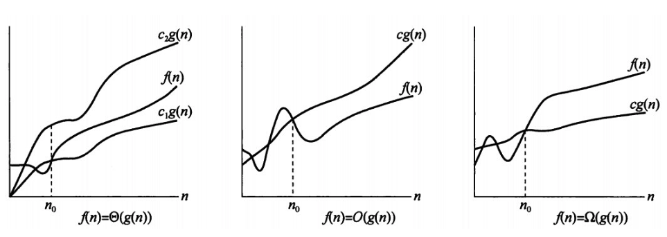

# 算法复杂度及渐进符号

## 一、算法复杂度

首先每个程序运行过程中，都要占用一定的计算机资源，比如内存，磁盘等，这些是空间，计算过程中需要判断，循环执行某些逻辑，周而反复，这些是时间。

那么一个算法有多好，多快，怎么衡量一个算法的好坏？所以，计算机科学在算法分析过程中，提出了算法复杂度理论，这套理论可以量化算法的效率，以此作为标准，方便我们能衡量到底选择哪一种算法。

复杂度有两个维度：时间和空间。

我们说，一个实现了某算法的程序，如果计算的速度越快，那么这个算法时间复杂度越低，如果占用的计算资源越少，那么空间复杂度越低。

我们要选择复杂度低的算法，衡量好空间和时间的消耗，选出适合特定场景的算法。

这两个复杂度维度的量化过程都是一样的，所以我们这里主要介绍时间复杂度。

## 二、算法规模

我们要计算公式 `1+2+3+...+100`，那么按照最直观的算法来写：

```go
package main

import "fmt"

func sum(n int) int {
	total := 0
	for i := 1; i <= n; i++ {
		total = total + i
	}
	return total
}

func main() {
	fmt.Println(sum(100))
}
```

当 `n = 10` 时就等于我们要计算的公式。这个算法要循环 `n-1` 次，当 `n` 很小时，计算很快，但当 `n` 无限大的时候，计算很慢。

所以，算法衡量要衡量的是在不同问题规模 `n` 下，算法的速度。

在这里，因为要循环计算 `n-1` 次，而当 `n` 无限大时，常数项基本忽略不计，所以这个算法的时间复杂度是 `O(n)`。

我们有另外一种计算方式：

```go
func sum2(n int) int {
	total := ((1 + n) * n) / 2
	return total
}
```

这次算法只需执行 1 次，所以这个算法的时间复杂度是 `O(1)`。可以看出，时间复杂度为 `O(1)` 的算法优于复杂度为 `O(n)` 的算法。

当然，还有指数级别的，对数级别的，阶乘级别的复杂度，如 `O(2^n)`，`O(n!)`，`O(logn)` 等。

算法的优先级排列如下，一般排在上面的要优于排在下面的：


1. 常数复杂度：`O(1)`
2. 对数复杂度：`O(logn)`
3. 一次方复杂度：`O(n)`
2. 一次方乘对数复杂度：`O(nlogn)`
3. 乘方复杂度：`O(n^2)`，`O(n^3)`
4. 指数复杂度：`O(2^n)`
5. 阶乘复杂度：`O(n!)`
5. 无限大指数复杂度：`O(n^n)`


## 三、渐进符号

如何量化一个复杂度，到底有多复杂，计算机科学抽象出了几个复杂度渐进符号。渐进符号如下：

`O`，`ο`，`Θ`，`Ω`，`ω`，分别读作：Omicron（大欧），omicron（小欧），Theta（西塔），Omega（大欧米伽），omega（小欧米伽）。

假设算法 A 的运行时间表达式：`T(n)= 5*n^3+4*n^2`。

如果问题规模 `n` 足够大，那么低次方的项将无足轻重，运行时间主要取决于高次方的第一项。随着 `n` 大增大，第一项的常数也无足轻重了。

所以算法 A 的运行时间约等于 `T(n)` 约等于 `n^3`，记为 `T(n)=Θ(n^3)`。

`Θ` 的数学含义:

>设 `f(n)` 和 `g(n)` 是定义域 `n` 为自然数集合的函数，两个函数同阶，也就是当 `n` 无穷大时，`f(n)/g(n)` 等于某个大于0的常数 `c`，也可以说，存在正常量 `c1`，`c2` 和 `n0`，对于所有 `n>=n0`，有 `0<=c1*g(n)<=f(n)<=c2*g(n)`，那么可以记 `f(n)= Θ(g(n))`，`g(n)` 是 `f(n)` 的渐进紧确界。

`O` 的数学含义:

>设 `f(n)` 和 `g(n)` 是定义域 `n` 为自然数集合的函数， `f(n)` 函数的阶不高于 `g(n)` 函数的阶，，也可以说，存在正常量 `c` 和 `n0`，对于所有 `n>=n0`，有 `0<=f(n)<=c*g(n)`，那么可以记 `f(n)= O(g(n))`。`g(n)` 是 `f(n)` 的渐进上界。

`Ω` 的数学含义:

>设 `f(n)` 和 `g(n)` 是定义域 `n` 为自然数集合的函数， `f(n)` 函数的阶不低于 `g(n)` 函数的阶，，也可以说，存在正常量 `c` 和 `n0`，对于所有 `n>=n0`，有 `0<=cg(n)<=f(n)`，那么可以记 `f(n)= Ω(g(n))`。`g(n)` 是 `f(n)` 的渐进下界。

上面的定义很复杂，我们可以来看图：



当 `n` 值超过某个值时，`f(n)` 被 `g(n)` 两条线夹在中间，那么 `g(n)` 就是渐进精确界，如果 `g(n)` 的线在上面，就是渐进上界，如果 `g(n)` 线在下面，就是渐进下界。

我们一般会评估一个算法的渐进上界 `O`，因为这表示算法的最坏情况，这个上界可以十分不准确，但我们一般会评估得足够准确，比如：`设 f(n) = 5*n^3+4*n^2`，我们要求渐进上界。那么：

```
f(n) = O(n^3)，g(n) = n^3
f(n) = O(n^4)，g(n) = n^4
```

两个 `g(n)` 都是上界，因为令 `c=5` 时都存在：`0<=f(n)<=c*g(n))`。我们会取乘方更小的那个，因为这个界更逼近 `f(n)` 本身，所以我们一般说 `f(n) = O(n^3)`，算法的复杂度为大欧 `n` 的三次方，表示最坏情况。

同理，渐进下界 `Ω` 刚好与渐进上界相反，表示最好情况。比如还是这个假设：`设 f(n) = 5*n^3+4*n^2`，我们要求渐进下界。那么：

```
f(n) = Ω(n^3)，g(n) = n^3
f(n) = Ω(n^2)，g(n) = n^2
```

两个 `g(n)` 都是下界，因为令 `c=5` 时都存在：`0<=cg(n)<=f(n)`。我们准确评估的时候，要取乘方更大的那个，因为这个界更逼近 `f(n)` 本身，所以我们一般说 `f(n) = Ω(n^3)`，算法的复杂度为大欧米伽 `n` 的三次方，表示最好情况。

我们发现当 `f(n) = Ω(n^3) = O(n^3)` 时，其实 `f(n) = Θ(n)`。

另外两个渐进符号 `ο` 和 `ω` 一般很少使用，指不那么紧密的上下界，也就是评估的时候，不那么准确去评估，在评估最坏情况的时候使劲地往坏了评估，评估最好情况则使劲往好的评估，但是它不能刚刚好，比如上面的结果：

```
f(n) = O(n^3)，g(n) = n^3
f(n) = O(n^4)，g(n) = n^4
f(n) = Ω(n^3)，g(n) = n^3
f(n) = Ω(n^2)，g(n) = n^2
```

我们可以说：

```
f(n) = ο(n^4)，g(n) = n^4  往高阶的评估，不能同阶
f(n) = ω(n^2)，g(n) = n^2  往低阶的评估，不能同阶
```


关系如下：

| 记号 | 含义 | 通俗理解
| ---- | ---- | ---- |
| Θ | 紧确界 | 相当于"=" |
| O | 上界 | 相当于"<=" | 
| ο | 非紧的上界 | 相当于"<" |
| Ω | 下界 | 相当于">=" |
| ω | 非紧的下界 | 相当于">" |


## 四、总结

我们一般用 `O` 渐进上界来评估一个算法的时间复杂度，表示逼近的最坏情况。其他渐进符合基本不怎么使用。