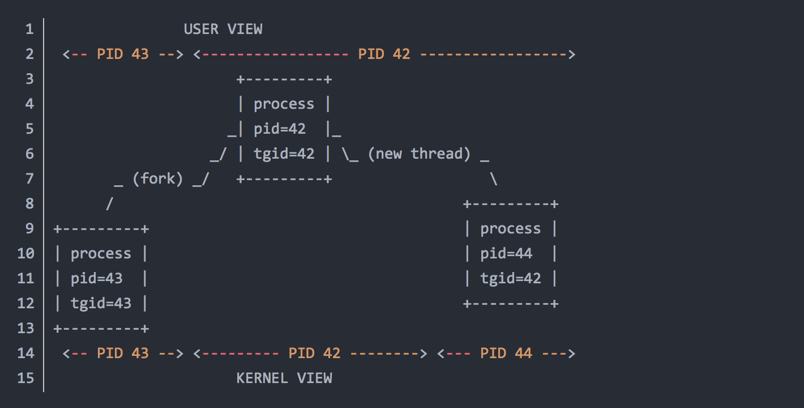

# 并发

我们写程序时，可能会读取一个几千兆的日志，读磁盘可能需要读几十秒钟，我们不可能一直等他，因为虽然磁盘 `IO` 繁忙，但是处理器 `CPU` 很空闲，我们可以并发地开另一条路去处理其他逻辑。

## 一、介绍

在操作系统层面，出现了多进程和多线程的概念。一个处理器会在一个时间片里比如20纳秒执行一个进程，当时间片用完了或者发生了中断比如进程抢占事件，当前进程上下文会被保存，然后处理器开始处理另外一个进程，这样频繁地切换执行，切换和执行的速度特别快，就产生了貌似程序们都在同时执行，其实还是串行执行，这种叫并发。在多核处理器上，进程可以调度到不同的处理器，时间片轮训也只是针对每一个处理器，同一时间在两个处理器上执行的两个进程，它们是实在的同时，这种叫并行。一般情况下，我们统称并发。

进程是计算机资源分配的最小单位，进程是对处理器资源(`CPU`)，虚拟内存（1）的抽象，

虚拟内存是对主存资源(`Memory`)和文件（2）的抽象，文件是对I/O设备的抽象。

>虚拟内存是操作系统初始化后内部维护的一个程序加载空间，对于32位操作系统来说，也就是寄存器有32位的比特长度，虚拟内存中每个字节都有一个内存地址，内存地址的指针长度为32位(刚好是寄存器可以存放的位数)，算下来2的32次，刚好可以存放4G左右的字节，所以在32位的操作系统上，你的8G内存条只有50%的利用率，所以现在都是64位的操作系统。

其中，`CPU`，`Memory`，`I/O` 设备就是我们所说的处理器，内存，硬盘。

线程是计算机调度的最小单位，也就是 `CPU` 大脑调度的最小单位，同个进程下的线程可以共享同个进程分配的计算机资源。

同个进程下的线程间切换需要 `CPU` 切换上下文，但不需要创建新的虚拟内存空间，不需要内存管理单元切换上下文，比不同进程切换会显得更轻量。

总上所述，实际并发的是线程。首先，每个进程都有一个主线程，因为线程是调度的最小单位，你可以只有一个线程，但是你也可以创建多几个线程，线程调度需要 `CPU` 来切换，需要内核层的上下文切换，如果你跑了A线程，然后切到B线程，内核调用开始，`CPU` 需要对A线程的上下文保留，然后切到B线程，然后把控制权交给你的应用层调度。进程切换也需要内核来切换，因为从C进程的主线程切换到D进程的主线程。

事实上，进程和线程只是概念上的划分，在操作系统内部，只用了一个数据结构来表示，里面有 `pid`：进程ID，`tgid`：线程属于的线程组ID（也就是进程ID，主线程ID），如下图（其中 `fork` 表示创建进程）：



每一个 `进程/线程` 都有一个 `pid`，如果它是主线程，那么 `tgid=pid`，从一个主线程 `fork` 出来的是另一个进程的主线程，`pid`，`tgid` 都变了，而 `new thread` 出来的线程，除了 `pid` 变了，`tgid` 不变。

进程间还要通讯，因为它们资源不共享，这个时候需要用 `IPC`（`Inter-Process Communication`，进程间通信），常用的有信号量，共享内存，套接字等。

而同个进程的多个线程共享资源，通讯起来比进程容易多了，因为它们共享了虚拟内存的空间，直接就可以读取内存，现在很多 `Python`，`Java` 等编程语言都有这种线程库实现。

至于 `IO` 多路复用，其实就是维持一个线程队列，然后让一个线程或多个线程，去队列里面拿任务去完成。为什么呢？因为线程的数量是有限的，而且线程间通讯需要点资源，内核也要频繁切换上下文，干脆就弄一个池，有任务就派个小弟出去。

只有一个线程的 `IO` 多路复用，典型的就是 `Redis` 和 `Nodejs` 了，根本不需要切换上下文，一个线程走天下。而多个线程的 `IO` 多路复用，就是 `Golang` 协程的实现方式了，协程，自己管理线程，把线程控制到一定的数量，然后构造一个规则状态机来调度任务。

## Golang协程

在操作系统更高层次的应用层，高级编程语言也有开发并发程序的需求。

无论是一个进程下的多个线程，还是不同进程，还是不同进程下的线程，切换时都需要损耗资源，浪费一些资源。所以 `Golang` 有协程这种东西，就是在语言内部管理自己的一些线程，维持一个固定线程数的线程池，进行合理的调度，使得线程不那么频繁的切换。

`Golang` 语言实现的调度器，其实就是通过使用数量合适的线程并在每一个线程上执行更多的工作来降低操作系统和硬件的负载。

如何实现：

```go

```